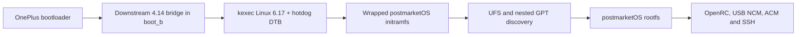

# Linux on the OnePlus 7T Pro (`hotdog`)

Experimental Linux and postmarketOS bring-up for the OnePlus 7T Pro. The
current development target is the European HD1913 model with a Qualcomm
Snapdragon 855+ (SM8150-AC).

> [!WARNING]
> This is early hardware enablement, not a daily-driver image. An unlocked
> bootloader and a dedicated test device are strongly recommended. A failed
> kernel can leave the phone unreachable until fastboot or recovery returns.

## Project status

Linux 6.17 now reaches the installed postmarketOS root filesystem on real
hardware. The validated path boots a downstream 4.14 kernel first and uses it
as a kexec bridge into mainline.

| Component | Status | Notes |
|---|---|---|
| Mainline kernel entry | Working | Linux `6.17.0-sm8150` starts through the downstream kexec bridge. |
| UFS storage | Working | Samsung UFS and the complete partition table are detected. |
| postmarketOS rootfs | Working | The nested `pmOS_root` filesystem mounts read-write. |
| USB networking | Working | NCM gadget, host address `172.16.42.2`, device address `172.16.42.1`. |
| SSH | Working | OpenSSH starts from the real postmarketOS userspace. |
| USB serial | Working | ACM console is exposed on `ttyGS0`. |
| Early display output | Partial | Kernel output is visible during early boot. |
| Mainline panel | Not working | The panel becomes black after early boot; the DRM path is not enabled. |
| RAM | Partial | Only about 448 MiB is currently exposed. |
| Touch, Wi-Fi, Bluetooth, audio, modem, cameras | Not validated | These remain bring-up work. |

See [docs/status.md](docs/status.md) for the detailed support matrix.

## Validated boot path



The bridge is a temporary engineering tool. The long-term target is a normal
postmarketOS/pmaports boot that does not depend on the downstream kernel.

## Mainline fixes validated so far

The successful boot is not a stock mainline device tree. It currently applies
the following bring-up changes:

1. Reserve the firmware-owned `0x89d00000-0x8b700000` memory gap as `no-map`.
2. Temporarily remove `iommus` from UFS and QUP clients because the Apps SMMU
   registration fails with `-EINVAL`.
3. Remove the UFS `qcom,ice` link so UFS can probe without the failing ICE
   clock path.
4. Remove the DWC3 `iommus` link so the USB gadget does not remain deferred
   behind the failed Apps SMMU.
5. Boot with `iommu.passthrough=1 arm-smmu.disable_bypass=0`.
6. Wait 120 seconds before the normal postmarketOS initramfs path. A 15-second
   delay was tested and is insufficient.
7. Keep the framebuffer probe in wait-only mode for its timing effect while
   removing all red/green/blue framebuffer writes.
8. Discover the postmarketOS GPT nested inside the Android `super` partition
   and expose its boot and root filesystems through loop devices.

These are bring-up fixes, not proposed upstream solutions. The SMMU bypasses,
ICE removal, reduced memory map, and timing waits all need proper replacements.
The technical evidence and rationale are documented in
[docs/mainline-bringup.md](docs/mainline-bringup.md).

## Getting started

Clone the repository and inspect the host without touching a phone:

```bash
git clone https://github.com/Sr-0w/hotdog-linux-bringup.git
cd hotdog-linux-bringup
./scripts/bootstrap-host.sh
```

Fetch the external source trees:

```bash
./scripts/bootstrap-sources.sh --kernel-mainline
cp pmbootstrap_v3.cfg.example pmbootstrap_v3.cfg
cp hotdog.env.example hotdog.env
./scripts/check-host-tools.sh
```

The repository does not distribute ready-to-flash boot images. Generated
kernels, initramfs archives, phone dumps, logs, and source checkouts stay in
ignored local directories. Follow [docs/host-setup.md](docs/host-setup.md),
[docs/artifacts.md](docs/artifacts.md), and
[docs/device-safety.md](docs/device-safety.md) before any hardware operation.

Once the validated local artifacts have been built or restored, the complete
mainline cycle is launched with:

```bash
./scripts/test-mainline617-pmos-full.sh
```

That launcher hash-checks the kernel, DTB, initramfs, and restore image before
transferring control to mainline.

## Repository layout

| Path | Purpose |
|---|---|
| `aports/` | Local postmarketOS package snapshots used during bring-up. |
| `docs/` | Public status, architecture, build, safety, and roadmap documentation. |
| `helpers/` | Small device-side diagnostic helpers. |
| `host/` | Host integration files such as udev and Gentoo configuration snippets. |
| `patches/` | Focused experimental kernel and boot patches. |
| `scripts/` | Reproducible build, inspection, test, and rescue tooling. |

The `src/`, `build/`, `images/`, `logs/`, `reports/`, `android-dumps/`,
`rootfs/`, `tools/`, and `pmbootstrap-work/` directories are local workspaces
and are not part of the Git history. Durable conclusions from experiments
belong in `docs/`; raw reports may contain device identifiers or proprietary
runtime data and must remain local.

## Documentation

- [Documentation index](docs/README.md)
- [Support status](docs/status.md)
- [Mainline bring-up fixes](docs/mainline-bringup.md)
- [Boot architecture](docs/boot-flow.md)
- [Host setup](docs/host-setup.md)
- [Device safety](docs/device-safety.md)
- [Artifacts and reproducibility](docs/artifacts.md)
- [Source trees](docs/sources.md)
- [Roadmap](docs/roadmap.md)

## Contributing

Hardware reports, DT reviews, pmaports packaging help, and focused fixes are
welcome. Read [CONTRIBUTING.md](CONTRIBUTING.md) before opening a pull request.
Reports should identify the exact model, kernel commit, DTB hash, boot method,
and observed result.

## License

The original tooling and documentation in this repository are licensed under
the GNU General Public License version 2. Third-party source snapshots and
derived files retain their respective upstream licenses. See [LICENSE](LICENSE).
