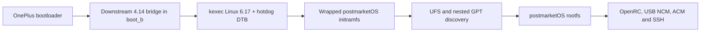

# Linux on the OnePlus 7T Pro (`hotdog`)

Experimental Linux and postmarketOS bring-up for the OnePlus 7T Pro. The
physical test handset is rear-labelled as a European HD1913 with a Qualcomm
Snapdragon 855+ (SM8150-AC), while its recovery and vendor software identify
it as HD1911 and expose the `hotdog` project/codename.

> [!WARNING]
> This is early hardware enablement, not a daily-driver image. An unlocked
> bootloader and a dedicated test device are strongly recommended. A failed
> kernel can leave the phone unreachable until fastboot or recovery returns.

## Project status

Linux 6.17 now reaches the installed postmarketOS root filesystem on real
hardware. The validated path boots a downstream 4.14 kernel first and uses it
as a kexec bridge into the exact K1 Linux 6.17 payload.

| Component | Status | Notes |
|---|---|---|
| Mainline kernel entry | Working | Linux `6.17.0-sm8150` starts through the downstream kexec bridge. |
| UFS storage | Working | Samsung UFS and the complete partition table are detected. |
| postmarketOS rootfs | Working | The nested `pmOS_root` filesystem mounts read-write. |
| USB networking | Working | NCM gadget, host address `172.16.42.2`, device address `172.16.42.1`. |
| SSH | Working | OpenSSH starts from the real postmarketOS userspace. |
| USB serial | Working | ACM console is exposed on `ttyGS0`. |
| Mainline reboot | Partial | Historical kexec testing proved a late-loaded exact `qcom-wdt.ko` can drive a physical reboot. The current r4 package builds `qcom-wdt` into the kernel; that path is not hardware-tested, and `RESTART2(bootloader)` remains unresolved on the observed DTB. |
| K1 package | Current r4 build evidence, hardware untested | Two builds in the tested pmbootstrap environment produced byte-identical `27,172,035`-byte APKs, SHA256 `74d7cff718be9a06b8858360fe56c1ccd8d1fd7653151546b0480029694d803e`. r4 installs the transformed `cf63ae...` DTB and uses `CONFIG_QCOM_WDT=y`; this is not hardware or cross-toolchain reproducibility evidence. |
| Persistent direct mainline | PID 1 and `kthreadd` handoff proven | D10 through D18 proved the complete `start_kernel()` path. D19 did not reach its post-`kernel_init_freeable()` reset, while D20 exhausted all retries immediately after the `kthreadd` handoff. The unresolved interval is now inside `kernel_init_freeable()`; D21 tests after SMP initialization. R6 plus stock DTBO is the verified rollback environment. |
| Firmware packaging | Complete, runtime unvalidated | The `20241212-r0` split produces eight usrmerged APKs with all payloads under `/usr/lib/firmware`; peripheral runtime support remains pending. |
| Early display output | Partial | Kernel output is visible during early boot. |
| Mainline panel | Not working | The panel becomes black after early boot; the DRM path is not enabled. |
| RAM | Partial | Only about 448 MiB is currently exposed. |
| Touch, Wi-Fi, Bluetooth, audio, modem, cameras | Not validated | These remain bring-up work. |

See [docs/status.md](docs/status.md) for the detailed support matrix.

## Validated boot path



The bridge is a temporary engineering tool. The long-term target is a normal
postmarketOS/pmaports boot that does not depend on the downstream kernel.

Persistent `boot_b` testing on 2026-07-12 established a working R5 rescue
baseline and three negative mainline handoff results. D1 AVB
`f8e83ae15cb016612433b8a2d800d828b025d56c76640a2ebb41a3061baf8994`
and D1-pack AVB
`2f3bf9b7cde3b2d48a3cf4d6fe2fb2f92e210e1a6b1249505fa15be10c26b754`
plus D2 header-v0 AVB
`2076c16598a63bfcfea416b47789eacf74086e33919c0715949cd42719f9b71e`
were each written and read back exactly before reboot, then returned to real
fastboot USB without an observed mainline USB identity. R5 was restored and
verified after each cycle. These controls exclude the tested boot-header and
DTB-placement variants, but do not identify the exact early failure boundary.

Offline overlay analysis found that the stock `dtbo_b` entry selected for this
hardware applies to the downstream DTB but fails against the K1 DTB with
`FDT_ERR_NOTFOUND`. D3 preserved the DTBO table and replaced only that overlay
with a no-op while booting unchanged D1. Raw host USB shows fastboot returning
3.84 seconds after disconnect, matching D1/D2. Its rollback restored and read
back original `dtbo_b` before exact R5 `boot_b`. D3-wdt and D4-entry produced
the same interval. The R5 control then proved the no-op DTBO itself is not a
valid baseline. D5 retained 56 fragments and applied cleanly to both DTBs; R5
reached its telnet initramfs but failed to mount the nested filesystems. D6
added K1 aliases for the vendor UFS symbols, retained 58 fragments, exposed all
UFS LUNs and USB ACM, then stalled during `pmos_continue_boot`; a repeat entered
Qualcomm `900e` crashdump mode. D7 retains the complete vendor UFS fragments
through an always-on fixed-regulator bridge for `ufs_phy_gdsc`. With unchanged
R5 it reached a fresh SSH boot on hardware, and strict readback confirmed the
R5 boot image plus D7 DTBO exactly. D8 then returned to fastboot after about
26 seconds; offline replay proved its embedded DTB could not accept D7. D9
embeds the corrected bridged DTB. The rollback environment is now R6 with the
stock DTBO: it reached fresh SSH with `watchdog_v2.enable=0`, and strict
readback matched both images exactly. See the
[2026-07-12 direct-boot evidence](docs/evidence/2026-07-12-direct-boot.md) and
[controlled test matrix](docs/direct-boot.md).

## Mainline fixes validated so far

The successful boot is not a stock mainline device tree. It currently applies
the following bring-up changes:

1. Reserve the firmware-owned `0x89d00000-0x8b700000` memory gap as `no-map`.
2. Temporarily remove `iommus` from UFS and QUP clients because the Apps SMMU
   registration fails with `-EINVAL`.
3. Remove the UFS `qcom,ice` link so UFS can probe without the failing ICE
   clock path.
4. Remove the DWC3 `iommus` link so the USB gadget does not remain deferred
   behind the failed Apps SMMU.
5. Boot with `iommu.passthrough=1 arm-smmu.disable_bypass=0`.
6. Wait 120 seconds before the normal postmarketOS initramfs path. A 15-second
   delay was tested and is insufficient.
7. Keep the framebuffer probe in wait-only mode for its timing effect while
   removing all red/green/blue framebuffer writes from the downstream 4.14
   userspace probe; those RGB frames were not emitted by mainline.
8. Discover the postmarketOS GPT nested inside the Android `super` partition
   and expose its boot and root filesystems through loop devices.
9. Capture the short-lived USB ACM console with host echo disabled so the
   collector does not feed bytes back into the target during early boot.
10. In the historical K1 configuration, load the matching `qcom-wdt.ko` after
    userspace comes up when a restart-handler probe is required. The current r4
    package instead builds this driver into the kernel and remains
    hardware-untested.

These are bring-up fixes, not proposed upstream solutions. The SMMU bypasses,
ICE removal, reduced memory map, and timing waits all need proper replacements.
The technical evidence and rationale are documented in
[docs/mainline-bringup.md](docs/mainline-bringup.md).

## Getting started

Clone the repository and inspect the host without touching a phone:

```bash
git clone https://github.com/Sr-0w/hotdog-linux-bringup.git
cd hotdog-linux-bringup
./scripts/bootstrap-host.sh
```

Fetch the external source trees:

```bash
./scripts/bootstrap-sources.sh --sm8150-k1
cp pmbootstrap_v3.cfg.example pmbootstrap_v3.cfg
cp hotdog.env.example hotdog.env
./scripts/check-host-tools.sh
./scripts/build-mainline-k1-dtb-chain.sh
```

The repository does not distribute ready-to-flash boot images. Generated
kernels, initramfs archives, phone dumps, logs, and source checkouts stay in
ignored local directories. Follow [docs/host-setup.md](docs/host-setup.md),
[docs/artifacts.md](docs/artifacts.md), and
[docs/device-safety.md](docs/device-safety.md) before any hardware operation.

Once the hash-pinned artifacts have been built or restored, the complete
mainline cycle is launched with:

```bash
./scripts/test-mainline617-pmos-full.sh
```

That launcher hash-checks the kernel, DTB, initramfs, and restore image before
transferring control to mainline.

The complete K1 DTB chain is reproducible from a clean source checkout and
tracked inputs. The launcher remains a lab replay until the kernel, initramfs,
and Android boot image are also produced entirely through the tracked pmaports
packages.

## Repository layout

| Path | Purpose |
|---|---|
| `aports/` | Local postmarketOS package snapshots used during bring-up. |
| `docs/` | Public status, architecture, build, safety, and roadmap documentation. |
| `helpers/` | Small device-side diagnostic helpers. |
| `host/` | Host integration files such as udev and Gentoo configuration snippets. |
| `patches/` | Focused experimental kernel and boot patches. |
| `scripts/` | Reproducible build, inspection, test, and rescue tooling. |

The `src/`, `build/`, `images/`, `logs/`, `reports/`, `android-dumps/`,
`rootfs/`, `tools/`, and `pmbootstrap-work/` directories are local workspaces
and are not part of the Git history. Durable conclusions from experiments
belong in `docs/`; raw reports may contain device identifiers or proprietary
runtime data and must remain local.

## Documentation

- [Documentation index](docs/README.md)
- [Support status](docs/status.md)
- [Mainline bring-up fixes](docs/mainline-bringup.md)
- [Direct mainline boot](docs/direct-boot.md)
- [Boot architecture](docs/boot-flow.md)
- [Host setup](docs/host-setup.md)
- [Device safety](docs/device-safety.md)
- [Artifacts and reproducibility](docs/artifacts.md)
- [Source trees](docs/sources.md)
- [Roadmap](docs/roadmap.md)
- [Hardware enablement roadmap](docs/hardware-roadmap.md)
- [pmaports upstreaming plan](docs/pmaports-upstreaming.md)

## Contributing

Hardware reports, DT reviews, pmaports packaging help, and focused fixes are
welcome. Read [CONTRIBUTING.md](CONTRIBUTING.md) before opening a pull request.
Reports should identify the exact model, kernel commit, DTB hash, boot method,
and observed result.

## License

The original tooling and documentation in this repository are licensed under
the GNU General Public License version 2. Third-party source snapshots and
derived files retain their respective upstream licenses. See [LICENSE](LICENSE).
