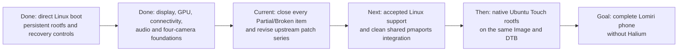
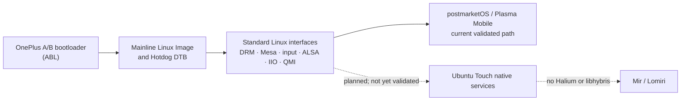

<h1 align="center">Linux on OnePlus 7T Pro</h1>

<p align="center">
  Mainline Linux, postmarketOS and native Ubuntu Touch/Lomiri bring-up for the
  OnePlus 7T Pro (<code>hotdog</code>).
</p>

<p align="center">
  
  
  
  
  
</p>

<p align="center">
  
</p>

<p align="center">
  <strong>OnePlus 7T Pro HD1913 · Snapdragon 855+ · Linux 6.16 · postmarketOS · Plasma Mobile</strong>
</p>

Last reviewed: **2026-08-13**

## Project goals

This repository develops upstream-quality support for the OnePlus 7T Pro
HD1913 (`hotdog`). The physical reference handset is rear-labelled HD1913 but
its recovery and vendor software report HD1911; all support claims are tied to
recorded hardware evidence.

The project has three equal completion goals:

1. support Hotdog in Linux mainline with maintainable drivers, bindings and
   DTS, without a permanent device-specific bring-up kernel;
2. make every real handset function **Working** and stable, and publish a clean
   postmarketOS port using the shared SM8150 kernel stack;
3. boot Ubuntu Touch and Lomiri directly on the same mainline kernel, without
   Halium, an Android kernel, Android HALs or `libhybris`.

The required final Ubuntu Touch chain is:

```text
OnePlus bootloader -> mainline Linux -> Ubuntu Touch -> Lomiri
```

These are targets, not present-tense support claims. No Ubuntu Touch image or
Lomiri session has been validated on Hotdog yet. See the complete
[roadmap](docs/roadmap.md) and [upstreaming plan](docs/pmaports-upstreaming.md).

## Current reference stack

| Component | Current development snapshot |
|---|---|
| Kernel package | `linux-oneplus-hotdog-mainline616` `6.16.0-r177` |
| Device package | `device-oneplus-hotdog` `3-r23` |
| Firmware package | `firmware-oneplus-hotdog` `20241212-r5` |
| Boot path | OnePlus A/B bootloader directly starts a header-v2 Linux image |
| Validated userspace | Writable postmarketOS edge, OpenRC and accelerated Plasma Mobile |
| Historical paths | Downstream 4.14/kexec and Linux 6.17 K1, retained for recovery and evidence only |

The Linux 6.16 package is a mainline-oriented reference stack. Its successful
hardware bring-up does not mean every carried change has been accepted into
Torvalds' Linux tree. The normal path no longer executes the downstream kernel
or a kexec bridge.

## Validated highlights

- Direct Linux boot from OnePlus ABL into a writable postmarketOS rootfs, with
  USB networking, SSH, clean reboot and automatic A/B success marking.
- Native 1440×3120 DSI/DSC scanout and accelerated Adreno 640 graphics through
  Freedreno/Turnip, including Plasma Mobile.
- Hardware validation of touch, physical keys, Wi-Fi, Bluetooth HID, both
  speakers and the handset microphone.
- USB-C dual role, powered host mode, USB 3, mass storage, Ethernet enumeration
  and DisplayPort video at 2560×1440@60.
- Capture from all four cameras through libcamera, rear autofocus and automatic
  Hall-bounded extension/retraction of the IMX471 pop-up camera.
- Both PM8150L flash channels register and pass electrical torch/strobe tests
  without a reported fault; visible output and camera synchronization remain.
- SM8150 IPA v4.1 creates `rmnet_ipa0`; modem QMI services answer without a SIM
  and QMI LOC can start and stop GNSS engine sessions.
- PN553 reader mode detects, activates and types a real ISO 14443-4 document
  and exchanges bidirectional ISO 7816-4 APDUs. Its unauthenticated ePassport
  BAC/PACE refusal is expected, not an NFC transport failure.
- The source-built AW8697 force-feedback driver produces physical vibration.
- The upstream-shaped SMB5 v3 candidate passed guarded 180-second and
  600-second charging runs, host authorization and a physical VBUS cycle.
- SLPI boot, FastRPC, writable Hexagon service, registry regeneration, QRTR,
  SSC requests and ULog forensics work end to end.

Support claims are evidence-based: an offline build, prepared DT change or
successful probe alone is never marked as hardware support.

## Support overview

This compact table mirrors the authoritative [support matrix](docs/status.md).
“Partial” means that the listed foundation works but the complete phone
function or its stability contract does not yet pass.

| Area | State | Current boundary |
|---|:---:|---|
| Direct boot and writable rootfs | Working | Mainline-oriented Linux 6.16 starts directly from ABL and reaches normal userspace. |
| GPU | Working | Adreno 640, GMU, Freedreno/Turnip, Vulkan and accelerated scanout work. |
| UFS storage | Partial | Normal I/O works; UFS ICE and longer suspend/stress coverage remain. |
| A/B, recovery and USB device mode | Partial | Clean reboot and success marking work; complete recovery modes and interactive ACM remain. |
| Internal display | Partial | 60 Hz is stable and 90 Hz is selectable; wake/blank and suspend reliability remain. |
| Touch and keys | Partial | Touch plus Power/Volume work; resume, wake, full slot and alert-slider coverage remain. |
| Wi-Fi and Bluetooth | Partial | Association, Internet reachability, scanning and HID work; identity, audio, coexistence and suspend remain. |
| Audio | Partial | Both speakers and handset microphone work; earpiece, other microphones, headset, call, Bluetooth and DP audio remain. |
| USB-C host and dock | Partial | Powered host, USB 3, storage, Ethernet enumeration and DP video work; source VBUS, broader hotplug, DP audio and suspend remain. |
| Battery and charging | Partial | Fuel gauge and guarded SMB5 v3 charging/VBUS tests pass; termination, JEITA, low battery, fast charge and suspend remain. |
| Cameras | Partial | All four capture, rear focus and pop-up lifecycle work; recovery, complete 3A/color, video, flash sync, OIS and broad apps remain. |
| IPA / rmnet | Working locally | `rmnet_ipa0` exists; upstream acceptance and SIM data validation remain. |
| Modem and telephony | Partial | MPSS/QMI services respond; SIM registration, data, SMS, calls and IMS remain. |
| GNSS | Partial | QMI LOC sessions work; standard location-service integration, real fixes, A-GPS and suspend policy remain. |
| NFC | Partial | Reader discovery and bidirectional APDU exchange work; lifecycle recovery, HCE and secure-element scope remain. |
| Haptics | Partial | Physical vibration works; range, repetition, feedbackd/Lomiri integration and suspend remain. |
| Camera flash | Partial | Both channels pass electrical torch/strobe tests; visible-light validation, current calibration and camera sync remain. |
| SLPI infrastructure | Partial | Host/DSP plumbing works and only infrastructure SUIDs are published. |
| Motion, light and proximity sensors | Broken | Both tested firmware sets reject QUP1/QUP2-to-EBI1 routes with `ICBARB_ERROR_NO_ROUTE_TO_SLAVE`. |
| System suspend | Broken | `pm_test=freezer` passes, but S6SY761 resume fails during device suspend. |
| Range sensor and fingerprint | Not yet supported | Driver, firmware, calibration and userspace integration remain. |
| Ubuntu Touch / Lomiri | Not yet supported | Native architecture, rootfs boot, packaging, recovery/OTA and Lomiri session remain roadmap phases. |

No subsystem is currently classified as known impossible.

## Where the project is now


```mermaid
flowchart LR
    A["Done: direct Linux boot<br/>persistent rootfs and recovery controls"] --> B["Done: display, GPU, connectivity,<br/>audio and four-camera foundations"]
    B --> C["Current: close every Partial/Broken item<br/>and revise upstream patch series"]
    C --> D["Next: accepted Linux support<br/>and clean shared pmaports integration"]
    D --> E["Then: native Ubuntu Touch rootfs<br/>on the same Image and DTB"]
    E --> F["Goal: complete Lomiri phone<br/>without Halium"]
```

The active engineering frontier is:

1. run the current SLPI firmware and sensor userspace on downstream Linux 4.14
   with the stock DTBO to distinguish a mainline platform difference from a DSP
   configuration fault;
2. bridge GNSS and mobile data into standard services and test SIM, SMS, calls
   and data;
3. close suspend, display wake, UFS ICE, remaining audio, dock, charging and
   camera-quality gaps;
4. replace temporary DT transforms, SMMU/ICE bypasses and laboratory deployment
   assumptions with clean source integration;
5. revise the Linux patch tracks through maintainer review, migrate the port to
   the shared SM8150 kernel, then implement the native Ubuntu Touch/Lomiri path.

The full dated graph and completed milestone ledger are in the
[roadmap timeline](docs/roadmap.md#timeline-and-current-position).

## Boot architecture


```mermaid
flowchart LR
    A["OnePlus A/B bootloader<br/>(ABL)"] --> B["Mainline Linux Image<br/>and Hotdog DTB"]
    B --> C["Standard Linux interfaces<br/>DRM · Mesa · input · ALSA · IIO · QMI"]
    C --> D["postmarketOS / Plasma Mobile<br/>current validated path"]
    C -. "planned; not yet validated" .-> E["Ubuntu Touch native services"]
    E -. "no Halium or libhybris" .-> F["Mir / Lomiri"]
```

The same upstream kernel and DTB must serve both distributions. Only their
initramfs, command line and userspace payloads may differ. See
[boot-flow.md](docs/boot-flow.md) for the complete architecture and historical
bridge boundary.

## Public release and quick start

> [!WARNING]
> This is early hardware enablement, not a daily-driver image. Use an unlocked,
> dedicated test handset and read [device safety](docs/device-safety.md) before
> any hardware operation.

The first public image set is `v0.1.0-alpha.1`, pairing postmarketOS Plasma
Mobile with the hardware-validated R108 Linux 6.16 boot chain. This release
identity is historical and distinct from the current `r176` development
package. Boot and rootfs artifacts form a matching UUID pair and must not be
mixed across releases. Follow the [release installation guide](docs/release-install.md).

Clone and bootstrap the host workspace:

```bash
git clone https://github.com/Sr-0w/hotdog-linux-bringup.git
cd hotdog-linux-bringup
./scripts/bootstrap-host.sh
```

The reproducible package build, image assembly, AVB checks and hardware-test
workflow are documented in [build-and-test.md](docs/build-and-test.md).

## Repository layout

| Path | Purpose |
|---|---|
| `aports/` | Local postmarketOS package snapshots used during bring-up. |
| `docs/` | Public status, architecture, evidence, safety and roadmap documentation. |
| `helpers/` | Small device-side diagnostic helpers. |
| `host/` | Host integration files such as udev and Gentoo configuration snippets. |
| `patches/` | Focused experimental kernel and boot patches. |
| `scripts/` | Reproducible build, inspection, test and rescue tooling. |

Local build trees, images, raw logs, complete RAM captures, credentials and
device identifiers are excluded from Git. Durable conclusions belong in
sanitized evidence records under `docs/`.

## Documentation

- [Documentation index](docs/README.md)
- [Support status](docs/status.md)
- [Bring-up history and validation narrative](docs/bringup-history.md)
- [Build and test workflow](docs/build-and-test.md)
- [Mainline bring-up fixes](docs/mainline-bringup.md)
- [Direct mainline boot](docs/direct-boot.md)
- [Boot architecture](docs/boot-flow.md)
- [Host setup](docs/host-setup.md)
- [Device safety](docs/device-safety.md)
- [Artifacts and reproducibility](docs/artifacts.md)
- [Source trees](docs/sources.md)
- [Roadmap](docs/roadmap.md)
- [Hardware enablement roadmap](docs/hardware-roadmap.md)
- [pmaports upstreaming plan](docs/pmaports-upstreaming.md)
- [Linux upstream submissions](docs/upstream-submissions.md)

## Contributing

Help is especially welcome with SM8150 upstream review, telephony/WWAN, SLPI
sensors, suspend/resume, remaining audio routes, camera quality and native
Lomiri integration. Read [CONTRIBUTING.md](CONTRIBUTING.md) before opening a
pull request. Hardware reports should identify the exact model, kernel commit,
DTB hash, boot method and observed result.

## License

Original tooling and documentation in this repository are licensed under the
GNU General Public License version 2. Third-party source snapshots and derived
files retain their upstream licenses. See [LICENSE](LICENSE).
