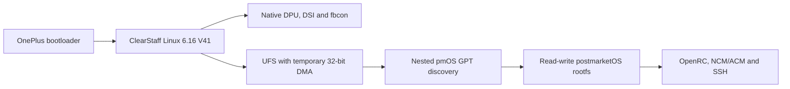

# Linux on the OnePlus 7T Pro (`hotdog`)

Experimental Linux and postmarketOS bring-up for the OnePlus 7T Pro. The
physical test handset is rear-labelled as a European HD1913 with a Qualcomm
Snapdragon 855+ (SM8150-AC), while its recovery and vendor software identify
it as HD1911 and expose the `hotdog` project/codename.

> [!WARNING]
> This is early hardware enablement, not a daily-driver image. An unlocked
> bootloader and a dedicated test device are strongly recommended. A failed
> kernel can leave the phone unreachable until fastboot or recovery returns.

## Project status

The mainline-oriented ClearStaff 6.16 V41 image now boots directly from the
OnePlus bootloader, initializes the native SM8150 display, enumerates UFS,
mounts the nested postmarketOS root filesystem read-write, completes
`switch_root`, starts OpenRC and `sshd`, and exposes USB NCM/ACM. This path does
not execute the downstream 4.14 kernel and does not use kexec. The bridge
remains available as a recovery and comparison environment.

V32 isolated the former UFS failure to DMA addressability: the controller was
operational and consumed its doorbell, but an UTRL allocated above 4 GiB kept
`OCS=0xf` and received no response UPIU while UFS was running without the Apps
SMMU. V33 conditionally constrains coherent UFS DMA to 32 bits only for the
SM8150 host whose temporary bring-up DT omits `iommus`. With every other boot
component unchanged, the phone enumerated `/dev/sda`, discovered the nested
`pmOS_boot` and `pmOS_root`, and entered the real rootfs. See the
[direct mainline rootfs evidence](docs/evidence/2026-08-03-direct-mainline-rootfs.md).

Native display bring-up reached a second major boundary on 2026-08-03. V29
corrected the MSM DSI command-mode packetization for the panel's two 720-pixel
DSC slices, and V30 added the generated 128-byte DSC PPS sent by the downstream
driver after its vendor panel-on commands. V30 produces readable kernel and
postmarketOS output on the physical panel. V33 keeps that path while reaching
the real rootfs. Dense scrolling currently appears repeated vertically, so the
remaining display work is scanout/DSI geometry rather than basic panel power or
kernel-console visibility. See the
[native display evidence](docs/evidence/2026-08-03-native-display.md).

Direct USB networking and SSH now work from the bootloader-started mainline
kernel. V39 localized the last Qualcomm `900e` transition to the first EP0
transfer command. V40 attached DWC3 to Apps SMMU stream `0x140`, which stopped
the crash but left the event ring unwritten while the kernel requested a
passthrough domain. V41 changed only `iommu.passthrough=1` to `0`; DWC3 then
completed EP0 transfers, exposed NCM and ACM, and postmarketOS became reachable
at `172.16.42.1` over SSH. See the
[direct mainline USB evidence](docs/evidence/2026-08-03-direct-mainline-usb.md).
V42 reproduces that result with the high-frequency EP0 trace removed and a
larger Terminus 16x32 console font. It reached verified SSH in 19 seconds; the
fbcon geometry changed from 180x195 to 90x97 characters as expected.
V43 is prepared from the pinned ClearStaff commit and the public patch series
only. It leaves generic DWC3, USB gadget, and IOMMU source untouched while
retaining V42's validated DTB and translated-domain setup.

An attempted live register comparison against R6 was stopped permanently after
the downstream `ufshcd_hold()` path timed out leaving hibern8 and entered a
broken vendor recovery path. The helper now fails closed. D16 instead uses the
normal R6 boot log plus the controller snapshot emitted by that timeout as its
passive downstream reference; see the
[R6 UFS incident record](docs/evidence/2026-08-01-r6-ufs-live-probe.md).

Failed direct boots can now be diagnosed from Qualcomm `900e` without reading
phone storage. The host performs a bounded physical-memory read of the 4 MiB
ramoops reservation and extracts the persistent kernel console. This confirmed
that D11 completed all 986 initcalls, entered the postmarketOS initramfs, failed
the same UFS NOP, and reached its controlled 90-second panic. D12 reproduced
that controlled path while proving the HS-G3 runtime guard executed. D13 then
proved that the missing revision-2 lane values alone do not establish the link,
and D14 ruled out its attempted reset-order change as sufficient.

| Component | Status | Notes |
|---|---|---|
| Mainline kernel entry | Working | Linux `6.17.0-sm8150` starts through kexec; the mainline-oriented ClearStaff 6.16 image starts directly from the OnePlus bootloader. |
| UFS storage | Working directly with a temporary DMA constraint | V33 enumerates the Samsung UFS directly. While Apps SMMU is bypassed, coherent UFS DMA is conditionally constrained below 4 GiB. |
| postmarketOS rootfs | Working directly | V33 mounts nested `pmOS_root` read-write as `/dev/loop1` and completes `switch_root` without kexec. |
| USB networking | Working directly | V41 exposes NCM with host `172.16.42.2` and device `172.16.42.1`; repeated ping and SSH sessions remain stable. |
| SSH | Working directly | OpenSSH starts on the direct postmarketOS rootfs and reports `Linux hotdog 6.16.0-sm8150+`. |
| USB serial | Enumerating directly | V41 exposes a CDC ACM interface and creates `ttyGS0`; interactive serial validation remains pending. |
| Mainline reboot | Working through kexec; direct recovery partial | `RESTART2(bootloader)` works after kexec. Direct failures can enter Qualcomm `900e`, where ramoops is readable, but still require a bootloader opportunity for partition rollback. |
| K1 package | Current r5 build evidence, package hardware test pending | One strict pmbootstrap build produced a `27,172,103`-byte r5 APK, SHA256 `f3083fd4c6af13be364eb0317873ee3a6f3690c5acb3a9e111c65b26b1746dd6`. Its embedded config keeps `CONFIG_RAID6_PQ=y`, disables `CONFIG_RAID6_PQ_BENCHMARK`, and uses `CONFIG_QCOM_WDT=y`. |
| Persistent direct mainline | Rootfs boot working | V33 boots from persistent `boot_b`, enumerates storage, mounts rootfs, starts `udevd`, and launches the visible rootfs shell. |
| Firmware packaging | Complete, runtime unvalidated | The `20241212-r0` split produces eight usrmerged APKs with all payloads under `/usr/lib/firmware`; peripheral runtime support remains pending. |
| Early display output | Working through native DRM/fbcon | V30 initializes `msm`, registers `fb0`, and displays readable kernel plus postmarketOS initramfs output at 180x195 characters. |
| Mainline panel | Partial | Native DPU, DSI, TE, DSC, and the OnePlus Samsung panel initialize. Dense fbcon output is repeated vertically; V31 isolates scanout geometry with a non-scrolling test. |
| RAM | Direct map working; bridge map constrained | Direct boot exposes the bootloader-provided multi-gigabyte map. The historical kexec bridge intentionally constrains its payload to the low bank. |
| Touch, Wi-Fi, Bluetooth, audio, modem, cameras | Not validated | These remain bring-up work. |

See [docs/status.md](docs/status.md) for the detailed support matrix.

## Validated boot path


```mermaid
flowchart LR
    A["OnePlus bootloader"] --> B["ClearStaff Linux 6.16 V41"]
    B --> C["Native DPU, DSI and fbcon"]
    B --> D["UFS with temporary 32-bit DMA"]
    D --> E["Nested pmOS GPT discovery"]
    E --> F["Read-write postmarketOS rootfs"]
    F --> G["OpenRC, NCM/ACM and SSH"]
```

The bridge is a temporary engineering tool. The long-term target is a normal
postmarketOS/pmaports boot that does not depend on the downstream kernel.

The tested OnePlus ABL does not provide a dependable unattended fallback to a
known-good A slot: after slot B reached retry count zero, firmware kept B active
and displayed the red failure screen instead of selecting successful slot A.
The PM8150 PON bootloader reason works from a mainline kexec boot, but D46-D48
did not make it a dependable pre-MMU recovery path. Current direct-boot tests
therefore keep a verified R6 restore image, place one candidate on slot B, and
classify the result from the display. The tested bounded-udev candidate armed
the APSS watchdog from PID 1 with the bootloader restart reason. That hardware
test reached the postmarketOS stage-two handoff, but its shell worker did not
return the phone to Fastboot after the logical deadline. The prepared follow-up
used the standalone static supervisor described above, reached
`setup_udev`, and likewise failed to expose Fastboot after the deadline. The
static fork/exec candidate gave the same aggregate 9/11 result. Its
per-command follow-up stopped at 7/11, isolating the first bounded `udevd`
launch. The udev-bypass follow-up reached 11/11 without exposing USB. The USB
prerequisite diagnostic reached 8/11, proving configfs availability and placing
the next boundary at UDC registration. Its DWC3 successor reached 7/11 because
D7 changed `/soc@0` from `#address-cells = 2`, `#size-cells = 2` to `1/1`.
That makes the unchanged four-cell mainline `reg` properties malformed and
explains why the expected `a6f8800.usb` platform entry was absent. The next
candidate uses the D3 no-op DTBO, whose offline application leaves the embedded
DTB byte-identical. It also builds the QCOM watchdog into the kernel, retains
the PM8150 Fastboot restart mode after initcalls, and packages the static rescue
supervisor. The resulting DWC3 wrapper and HS-PHY subtrees match the known-good
mainline kexec DTB property-for-property, and every driver needed to expose the
configfs NCM/ACM gadget is built into the exact candidate kernel.
A detached host supervisor still
restores and verifies R6 whenever Fastboot becomes visible.

D39 was reproduced unchanged with the original R6/B transaction, seven slot
retries, and a fixed logo for 90 seconds. Rebased D40 changes only the checkpoint
from entry 69 to entry 66 and also held at the fixed logo for 110 seconds. D41
changes only the checkpoint to entry 33; it reset repeatedly, exhausted the
slot-B attempts, and selected the working R6 image on slot A. The valid
unresolved range was therefore `subsys` entries 34-66. D42 held at the fixed
logo and did not reach its checkpoint after entry 49, narrowing that range to
entries 34-49. D43 reached its checkpoint after entry 41 and automatically
fell back to R6 on slot A, narrowing the range to entries 42-49. The search now
advances sequentially: D44 also reached its checkpoint after entry 42 and
returned through R6/A. D45, D46, and D47 then reached entries 43, 44, and 45.
D47 and D48 were restored directly to R6/B by the prearmed watcher, proving
entries 45 and 46 return. D49 then fell back to R6/A after entry 47 and was
recovered through software fastboot. D50 then proved entry 48 returns. Combined
with D42, this isolates entry 49, `raid6_select_algo`. A supervised follow-up
kept `CONFIG_RAID6_PQ=y`, disabled only `CONFIG_RAID6_PQ_BENCHMARK`, reached
the checkpoint after entry 49, and reset into R6/A. R6/B plus the stock DTBO
were then restored and read back exactly. The workaround is validated; the
underlying early timer behavior still needs diagnosis. A subsequent direct
candidate removed the checkpoint, retained the single-CPU and no-benchmark
workarounds, and added the entry-time watchdog clear that is stable through
kexec. It still held the fixed OnePlus logo for 480 seconds without USB or
SSH, proving that another direct-only blocker remains after the RAID6 fix.
The intervening one-try experiments are superseded because they
reached the red failure screen with slot B already at retry count zero and do
not prove checkpoint execution.

The direct-entry trace no longer depends on slot retry behavior or a working
kernel console. It first proved the MMU transition, `start_kernel()`, and
`paging_init()`. A later failure was traced to retaining an `early_memremap()`
pointer after `early_ioremap_reset()`. Replacing that pointer with the normal
arm64 linear mapping after `paging_init()` exposed the complete post-init row:
the global async wait returned, init memory was released, `kernel_execve()`
succeeded, and all three EL1-to-EL0 transition markers appeared. A PID 1-only
syscall row then showed a first syscall entry and return, a second syscall, and
at least 16 total syscalls.

That PID 1 trace also exposed an Android boot-image contract issue. The tested
HD1913 bootloader ignores header-v2 `extra_cmdline` and copies only 511
characters from the primary 512-byte field. The diagnostic `rdinit=` token had
been stored beyond that boundary, so Linux correctly ran the original
postmarketOS `/init` instead of the static wrapper. The direct-image builder now
rejects longer command lines, and the next hash-pinned candidate places every
boot-critical token in the accepted field. Exact hashes and marker meanings are
recorded in the
[2026-07-30 direct PID 1 evidence](docs/evidence/2026-07-30-direct-pid1.md).

Persistent `boot_b` testing on 2026-07-12 established a working R5 rescue
baseline and three negative mainline handoff results. D1 AVB
`f8e83ae15cb016612433b8a2d800d828b025d56c76640a2ebb41a3061baf8994`
and D1-pack AVB
`2f3bf9b7cde3b2d48a3cf4d6fe2fb2f92e210e1a6b1249505fa15be10c26b754`
plus D2 header-v0 AVB
`2076c16598a63bfcfea416b47789eacf74086e33919c0715949cd42719f9b71e`
were each written and read back exactly before reboot, then returned to real
fastboot USB without an observed mainline USB identity. R5 was restored and
verified after each cycle. These controls exclude the tested boot-header and
DTB-placement variants, but do not identify the exact early failure boundary.

Offline overlay analysis found that the stock `dtbo_b` entry selected for this
hardware applies to the downstream DTB but fails against the K1 DTB with
`FDT_ERR_NOTFOUND`. D3 preserved the DTBO table and replaced only that overlay
with a no-op while booting unchanged D1. Raw host USB shows fastboot returning
3.84 seconds after disconnect, matching D1/D2. Its rollback restored and read
back original `dtbo_b` before exact R5 `boot_b`. D3-wdt and D4-entry produced
the same interval. The R5 control then proved the no-op DTBO itself is not a
valid baseline. D5 retained 56 fragments and applied cleanly to both DTBs; R5
reached its telnet initramfs but failed to mount the nested filesystems. D6
added K1 aliases for the vendor UFS symbols, retained 58 fragments, exposed all
UFS LUNs and USB ACM, then stalled during `pmos_continue_boot`; a repeat entered
Qualcomm `900e` crashdump mode. D7 retains the complete vendor UFS fragments
through an always-on fixed-regulator bridge for `ufs_phy_gdsc`. With unchanged
R5 it reached a fresh SSH boot on hardware, and strict readback confirmed the
R5 boot image plus D7 DTBO exactly. D8 then returned to fastboot after about
26 seconds; offline replay proved its embedded DTB could not accept D7. D9
embeds the corrected bridged DTB. The rollback environment is now R6 with the
stock DTBO: it reached fresh SSH with `watchdog_v2.enable=0`, and strict
readback matched both images exactly. See the
[2026-07-12 direct-boot evidence](docs/evidence/2026-07-12-direct-boot.md) and
[2026-07-15 RAID6 checkpoint evidence](docs/evidence/2026-07-15-raid6-direct-boot.md),
the [K1 userspace evidence](docs/evidence/2026-07-15-k1-kexec-userspace.md),
plus the [controlled test matrix](docs/direct-boot.md).

## Mainline fixes validated so far

The successful boot is not a stock mainline device tree. It currently applies
the following bring-up changes:

1. Reserve the firmware-owned `0x89d00000-0x8b700000` memory gap as `no-map`.
2. Temporarily remove `iommus` from UFS and QUP clients because the Apps SMMU
   registration fails with `-EINVAL`.
3. Remove the UFS `qcom,ice` link so UFS can probe without the failing ICE
   clock path.
4. Remove the DWC3 `iommus` link so the USB gadget does not remain deferred
   behind the failed Apps SMMU.
5. Boot with `iommu.passthrough=1 arm-smmu.disable_bypass=0`.
6. Wait 120 seconds before the normal postmarketOS initramfs path. A 15-second
   delay was tested and is insufficient.
7. Keep the framebuffer probe in wait-only mode for its timing effect while
   removing all red/green/blue framebuffer writes from the downstream 4.14
   userspace probe; those RGB frames were not emitted by mainline.
8. Discover the postmarketOS GPT nested inside the Android `super` partition
   and expose its boot and root filesystems through loop devices.
9. Capture the short-lived USB ACM console with host echo disabled so the
   collector does not feed bytes back into the target during early boot.
10. In the historical K1 configuration, load the matching `qcom-wdt.ko` after
    userspace comes up when a restart-handler probe is required. The current r5
    package instead builds this driver into the kernel and remains
    hardware-untested as a complete package payload.
11. Keep RAID6 enabled but disable `CONFIG_RAID6_PQ_BENCHMARK`. The benchmark
    waits for `jiffies` to advance and blocked the forced-single-CPU direct path;
    the no-benchmark candidate reached the next checkpoint on hardware.
12. Clear the APSS watchdog enable register in `primary_entry` for the K1 kexec
    payload. This exact Image reached postmarketOS SSH and remained stable; the
    direct candidate using the same clear still encountered a later blocker.
13. Release the diagnostic `early_memremap()` mapping before
    `early_ioremap_reset()` and use `phys_to_virt()` only after `paging_init()`.
    This is a diagnostic framebuffer lifetime fix, not a proposed display
    driver.
14. Keep direct-boot command lines at 511 characters or fewer. The tested ABL
    drops byte 512 and ignores the header-v2 `extra_cmdline` field.
15. While the Apps SMMU is bypassed, constrain coherent SM8150 UFS DMA to 32
    bits. V32 proved that an UTRL above 4 GiB was consumed without descriptor
    completion; V33 changed only this mask and reached the read-write rootfs.

These are bring-up fixes, not proposed upstream solutions. The SMMU bypasses,
ICE removal, reduced memory map, and timing waits all need proper replacements.
The technical evidence and rationale are documented in
[docs/mainline-bringup.md](docs/mainline-bringup.md).

## Getting started

Clone the repository and inspect the host without touching a phone:

```bash
git clone https://github.com/Sr-0w/hotdog-linux-bringup.git
cd hotdog-linux-bringup
./scripts/bootstrap-host.sh
```

Fetch the external source trees:

```bash
./scripts/bootstrap-sources.sh --sm8150-k1
cp pmbootstrap_v3.cfg.example pmbootstrap_v3.cfg
cp hotdog.env.example hotdog.env
./scripts/check-host-tools.sh
./scripts/build-mainline-k1-dtb-chain.sh
```

The hardware-tested V30 direct-display kernel can be rebuilt byte-for-byte
from the pinned ClearStaff commit, the public patch series, and the checked-in
kernel configuration:

```bash
./scripts/prepare-clearstaff616-source.sh
./scripts/build-clearstaff616-v30-kernel.sh
```

The build stops unless the selected source files, generated configuration, and
final arm64 `Image` match their recorded SHA256 values. The separate
`build-clearstaff616-v30-dynamic-pps.sh` packager also validates its DTB, DTBO,
initramfs, command line, and Android boot-image inputs; those earlier
bring-up artifacts are not yet all regenerated by one clean public command.

The repository does not distribute ready-to-flash boot images. Generated
kernels, initramfs archives, phone dumps, logs, and source checkouts stay in
ignored local directories. Follow [docs/host-setup.md](docs/host-setup.md),
[docs/artifacts.md](docs/artifacts.md), and
[docs/device-safety.md](docs/device-safety.md) before any hardware operation.

Once the hash-pinned artifacts have been built or restored, the complete
mainline cycle is launched with:

```bash
./scripts/test-mainline617-pmos-full.sh
```

That launcher hash-checks the kernel, DTB, initramfs, and restore image before
transferring control to mainline.

The complete K1 DTB chain is reproducible from a clean source checkout and
tracked inputs. The launcher remains a lab replay until the kernel, initramfs,
and Android boot image are also produced entirely through the tracked pmaports
packages.

## Repository layout

| Path | Purpose |
|---|---|
| `aports/` | Local postmarketOS package snapshots used during bring-up. |
| `docs/` | Public status, architecture, build, safety, and roadmap documentation. |
| `helpers/` | Small device-side diagnostic helpers. |
| `host/` | Host integration files such as udev and Gentoo configuration snippets. |
| `patches/` | Focused experimental kernel and boot patches. |
| `scripts/` | Reproducible build, inspection, test, and rescue tooling. |

The `src/`, `build/`, `images/`, `logs/`, `reports/`, `android-dumps/`,
`rootfs/`, `tools/`, and `pmbootstrap-work/` directories are local workspaces
and are not part of the Git history. Durable conclusions from experiments
belong in `docs/`; raw reports may contain device identifiers or proprietary
runtime data and must remain local.

## Documentation

- [Documentation index](docs/README.md)
- [Support status](docs/status.md)
- [Mainline bring-up fixes](docs/mainline-bringup.md)
- [Direct mainline boot](docs/direct-boot.md)
- [Boot architecture](docs/boot-flow.md)
- [Host setup](docs/host-setup.md)
- [Device safety](docs/device-safety.md)
- [Artifacts and reproducibility](docs/artifacts.md)
- [Source trees](docs/sources.md)
- [Roadmap](docs/roadmap.md)
- [Hardware enablement roadmap](docs/hardware-roadmap.md)
- [pmaports upstreaming plan](docs/pmaports-upstreaming.md)

## Contributing

Hardware reports, DT reviews, pmaports packaging help, and focused fixes are
welcome. Read [CONTRIBUTING.md](CONTRIBUTING.md) before opening a pull request.
Reports should identify the exact model, kernel commit, DTB hash, boot method,
and observed result.

## License

The original tooling and documentation in this repository are licensed under
the GNU General Public License version 2. Third-party source snapshots and
derived files retain their respective upstream licenses. See [LICENSE](LICENSE).
