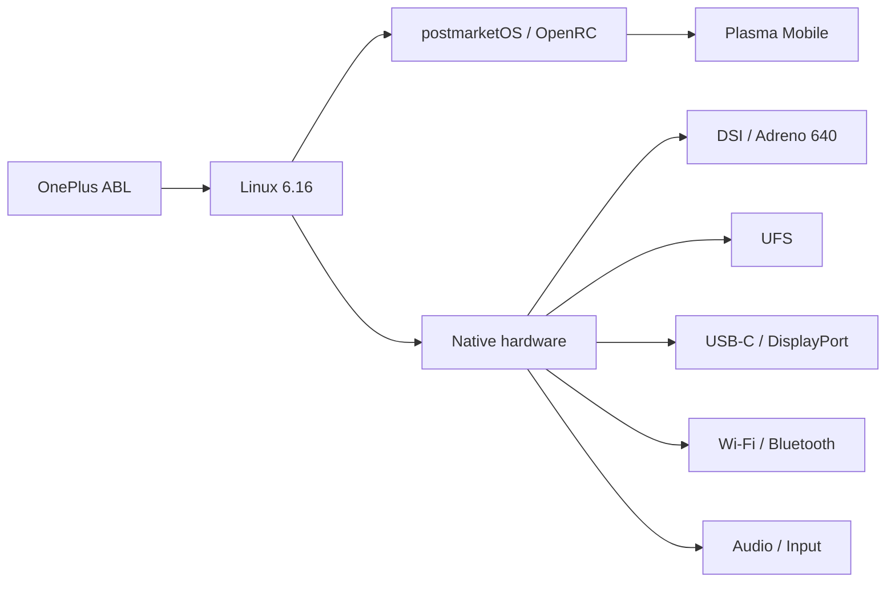

<h1 align="center">Linux on OnePlus 7T Pro</h1>

<p align="center">
  Mainline Linux / postmarketOS bring-up for the OnePlus 7T Pro (<code>hotdog</code>).
</p>

<p align="center">
  
  
  
  
  
</p>

<p align="center">
  
</p>

<p align="center">
  <strong>OnePlus 7T Pro HD1913 · Snapdragon 855+ · Linux 6.16 · postmarketOS · Plasma Mobile</strong>
</p>

## What is this?

Experimental Linux and postmarketOS bring-up for the OnePlus 7T Pro. The
physical test handset is rear-labelled as a European HD1913 with a Qualcomm
Snapdragon 855+ (SM8150-AC), while its recovery and vendor software identify
it as HD1911 and expose the `hotdog` project/codename.

The project has two equal goals: become **publishable in postmarketOS** through
shared, upstreamable integration instead of a permanent device-specific bring-up
kernel, and reach **complete hardware support** across the handset, including
USB-C/dock functionality, cameras, sensors and telephony. See the
[roadmap](docs/roadmap.md) and [pmaports upstreaming plan](docs/pmaports-upstreaming.md).

## Highlights

- Boots Linux directly from the stock OnePlus bootloader — no kexec required.
- Runs a full postmarketOS Plasma Mobile installation from persistent storage.
- Native 1440×3120 DSI/DSC display with accelerated Adreno 640 rendering.
- Working USB-C dual-role, USB 3 SuperSpeed and DisplayPort video output.
- Hardware bring-up is validated on a physical European HD1913 handset.

## Current status

✅ Direct boot from OnePlus bootloader  
✅ Native 1440×3120 display  
✅ Adreno 640 accelerated graphics  
✅ Touchscreen and hardware keys  
✅ Wi-Fi and Bluetooth  
✅ Internal speakers and handset microphone  
✅ USB-C host, USB 3 and DisplayPort video  
✅ Battery fuel gauge  

⚠️ Suspend/resume incomplete  
⚠️ 90 Hz wake path unreliable  
❌ DisplayPort audio currently broken  
🚧 Telephony, cameras and sensors still in progress

> [!NOTE]
> **Support claims are hardware evidence based.** An offline build, prepared DT
> change or successful probe alone is never marked as supported.

## Hardware support

Support status for the tested HD1913 handset.

### 🟢 Working

| Subsystem | Function | Notes |
|---|---|---|
| Boot | Direct boot from OnePlus bootloader | Package-built Linux 6.16, DTB, initramfs and postmarketOS rootfs direct-boot from `boot_b`. |
| Boot | Persistent postmarketOS rootfs / OpenRC / SSH | Read-write rootfs, OpenRC, USB networking and SSH are hardware-validated. |
| Storage | UFS | Direct boot, raw I/O, large buffered writes/imports and application workloads pass with the current reservation fixes. |
| Memory | RAM map and firmware reservations | The complete stock HD1913 reservation union is applied and passed the workload that previously collided with firmware-owned memory. |
| Display | Internal panel 1440×3120 at 60 Hz | Native DPU/DSI/DSC KMS scanout is stable in graphical userspace. |
| GPU | Adreno 640 / GMU / Turnip | Vulkan workloads, `kmscube`, Weston and Plasma Mobile use accelerated rendering without observed GPU/GMU/IOMMU faults. |
| Input | S6SY761 touchscreen | Touch, drag, pressure, multitouch and graphical orientation are hardware-validated. |
| Input | Power key | PM8150 PON power-key input is present and physical power-button interaction has been observed on hardware. |
| Input | Volume Down | The original RESIN mapping was invalidated; the corrected PM8150 GPIO7 mapping is physically tested and functional. |
| Input | Volume Up | PM8150 GPIO6 / `KEY_VOLUMEUP` is physically tested and functional. |
| USB | USB gadget / NCM networking | Stable host ping and SSH at `172.16.42.1` through the translated DWC3 SMMU path. |
| USB-C | Type-C dual role and USB-PD detection | Type-C partner/PD state is exposed and device/sink negotiation works. |
| USB-C | Host mode through powered dock | xHCI, a hub and attached devices enumerate while the handset remains a power sink. |
| USB-C | USB 3 SuperSpeed | Dock hub and RTL8153 enumerate at 5 Gbit/s. |
| USB-C | USB mass storage | A SanDisk device enumerates, mounts and reads through the dock. |
| DisplayPort | External video at 2560×1440@60 | Plasma reaches the external monitor with correct image while the internal panel remains active. |
| Audio | Internal stereo speakers | Both TFA9874 speaker channels are independently hardware-validated and work through the packaged UCM/PulseAudio path. |
| Audio | Handset microphone | AMIC4 with MIC BIAS1 is acoustically validated from the packaged profile and confirmed by listening. |
| Wi-Fi | WCN3990 association and IPv4 connectivity | Both bands scan, NetworkManager associates and basic external IPv4 reachability is validated. |
| Modem | MPSS remote processor / QRTR services | MPSS reaches `running`; RMTFS, QRTR, PD mapper and related services are present. |
| Power | Fuel gauge / battery level / temperature / current / capacity | The gauge uses the bq27421 register layout; `ti,bq27411` reports coherent SoC, voltage, temperature, current and 3856/4040 mAh capacity on hardware. |

### 🟡 Partial

| Subsystem | Function | Notes |
|---|---|---|
| Boot | Reboot to bootloader / recovery integration | Bootloader restart reason works from the validated kexec path; direct recovery-mode integration remains incomplete. |
| Display | Internal panel 90 Hz / dynamic 60↔90 selection | 90 Hz and runtime mode switching work, but wake/blank-unblank reliability is not yet acceptable. |
| USB | USB ACM serial | CDC ACM enumerates and `ttyGS0` exists; an interactive serial session remains unvalidated. |
| USB-C | USB Ethernet | RTL8153 enumerates, `r8152` binds and creates `eth0`; link/data were not tested because no Ethernet cable was attached. |
| Wi-Fi | Power management / suspend / stable factory identity | Basic data works; sustained PM/suspend and factory-address handling remain insufficiently tested. |
| Bluetooth | Scan and HID connectivity | Scanning and real HID connections work, but one historical `900e` event plus incomplete repeated/suspend/audio validation keep this partial. |
| Power | SMB5 charging basic limits | 4.40 V float, 1.50 A fast-charge and 500 mA USB input limits are directly verified; termination, low-SoC, thermal and long-duration policy remain open. |

### 🔴 Broken

| Subsystem | Function | Notes |
|---|---|---|
| Storage | UFS ICE | ICE probe fails; the working UFS path currently runs without ICE. |
| DisplayPort | 2560×1440@120 on two-lane HBR2 | Hardware output is persistently corrupt; msm DP currently accepts a mode that exceeds the available link budget. |
| DisplayPort | Audio | Linux-side backend is present, but the ADSP times out starting AFE port `0x6020`. |
| Power | System suspend / s2idle | Freezer passes, but `pm_test=devices` fails on S6SY761 resume; usable system suspend is currently broken. |

### ⚪ Not yet supported

| Subsystem | Function | Notes |
|---|---|---|
| USB-C | Source VBUS for an unpowered peripheral | Not yet hardware-tested. |
| Audio | Earpiece | Not yet brought up/validated. |
| Audio | Headset / other headphone paths and detection | Remaining headset routing/detection paths are not hardware-validated. |
| Audio | Other analogue/digital microphones, EC/NR | Other live pads, digital microphones, echo cancellation and noise-reduction policy remain open. |
| Cellular | WWAN data / calls / SMS / SIM handling | Telephony stack is not yet hardware-validated. |
| GNSS | Location | Not yet hardware-validated. |
| Cameras | Rear main / ultra-wide / telephoto / front | The S5K3M5 telephoto probes and streams complete RAW10 frames into CSID, and the CSID test generator independently reaches VFE. VFE DMA is currently rejected by CAMNOC before reaching RAM; the three Sony sensor drivers and libcamera integration remain open. |
| Sensors | Motion / rotation / proximity | Mainline integration remains to be implemented and hardware-tested. |
| NFC | NFC / secure-element path | Not yet hardware-validated. |
| Haptics | AW8697 | No mainline driver/integration is validated yet. |
| Hall sensors | MXM1120 | Driver/integration work remains. |
| Range sensor | STMVL53L1 laser rangefinder | Driver/integration work remains. |
| Fingerprint | In-display fingerprint reader | Plasma/fprintd can provide the userspace authentication path; Hotdog still needs sensor/firmware integration and UDFPS display-illumination coordination. |
| Fast charging | OnePlus Warp charge | Vendor-dependent path; no mainline hardware support is validated. |

### ⚫ Impossible

_None currently identified._

| State | Meaning |
|:---:|---|
| 🟢 | Hardware validated |
| 🟡 | Partial / insufficiently tested |
| 🔴 | Tested and currently broken |
| ⚪ | Not implemented or hardware-tested |
| ⚫ | Known impossible |

Detailed evidence and limitations: [docs/status.md](docs/status.md).

## Current blockers

| Area | Issue |
|---|---|
| Suspend | S6SY761 resume currently fails during the device suspend test stage. |
| DisplayPort audio | ADSP does not start AFE port `0x6020`. |
| DP 1440p120 | MSM DP accepts a mode that exceeds the available two-lane HBR2 budget. |
| UFS ICE | ICE probe fails; the validated UFS path currently operates without ICE. |

## Architecture


```mermaid
flowchart LR
    A["OnePlus ABL"] --> B["Linux 6.16"]
    B --> C["postmarketOS / OpenRC"]
    C --> D["Plasma Mobile"]
    B --> E["Native hardware"]
    E --> F["DSI / Adreno 640"]
    E --> G["UFS"]
    E --> H["USB-C / DisplayPort"]
    E --> I["Wi-Fi / Bluetooth"]
    E --> J["Audio / Input"]
```

The normal pmaports path no longer depends on the downstream bridge. Detailed
chronological bring-up, superseded experiments, recovery work and validated
mainline fixes live in [docs/bringup-history.md](docs/bringup-history.md).

## Quick start

> [!WARNING]
> This is early hardware enablement, not a daily-driver image. An unlocked
> bootloader and a dedicated test device are strongly recommended. A failed
> kernel can leave the phone unreachable until fastboot or recovery returns.

Clone the repository and bootstrap the host-side workspace:

```bash
git clone https://github.com/Sr-0w/hotdog-linux-bringup.git
cd hotdog-linux-bringup
./scripts/bootstrap-host.sh
```

The complete source bootstrap, reproducible kernel/package build, image
assembly, AVB validation, and hardware-test workflow is documented in
[docs/build-and-test.md](docs/build-and-test.md). Read
[docs/device-safety.md](docs/device-safety.md) before any hardware operation.

## Repository layout

| Path | Purpose |
|---|---|
| `aports/` | Local postmarketOS package snapshots used during bring-up. |
| `docs/` | Public status, architecture, build, safety, and roadmap documentation. |
| `helpers/` | Small device-side diagnostic helpers. |
| `host/` | Host integration files such as udev and Gentoo configuration snippets. |
| `patches/` | Focused experimental kernel and boot patches. |
| `scripts/` | Reproducible build, inspection, test, and rescue tooling. |

The `src/`, `build/`, `images/`, `logs/`, `reports/`, `android-dumps/`,
`rootfs/`, `tools/`, and `pmbootstrap-work/` directories are local workspaces
and are not part of the Git history. Durable conclusions from experiments
belong in `docs/`; raw reports may contain device identifiers or proprietary
runtime data and must remain local.

## Documentation

- [Documentation index](docs/README.md)
- [Support status](docs/status.md)
- [Bring-up history and validation narrative](docs/bringup-history.md)
- [Build and test workflow](docs/build-and-test.md)
- [Mainline bring-up fixes](docs/mainline-bringup.md)
- [Direct mainline boot](docs/direct-boot.md)
- [Boot architecture](docs/boot-flow.md)
- [Host setup](docs/host-setup.md)
- [Device safety](docs/device-safety.md)
- [Artifacts and reproducibility](docs/artifacts.md)
- [Source trees](docs/sources.md)
- [Roadmap](docs/roadmap.md)
- [Hardware enablement roadmap](docs/hardware-roadmap.md)
- [pmaports upstreaming plan](docs/pmaports-upstreaming.md)

## Contributing

The project particularly welcomes help with:

- SM8150 CAMSS and camera sensors
- telephony / WWAN
- suspend / resume
- sensors
- upstreaming the remaining board-specific workarounds

Hardware reports, DT reviews, pmaports packaging help, and focused fixes are
welcome. Read [CONTRIBUTING.md](CONTRIBUTING.md) before opening a pull request.
Reports should identify the exact model, kernel commit, DTB hash, boot method,
and observed result.

## License

The original tooling and documentation in this repository are licensed under
the GNU General Public License version 2. Third-party source snapshots and
derived files retain their respective upstream licenses. See [LICENSE](LICENSE).
