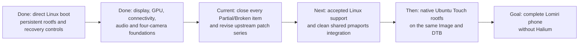
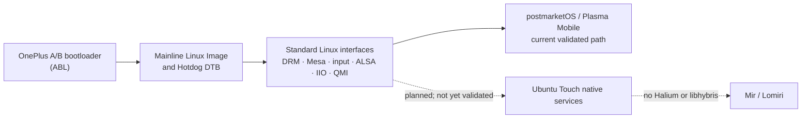

<h1 align="center">Linux on OnePlus 7T Pro</h1>

<p align="center">
  Mainline Linux, postmarketOS and native Ubuntu Touch/Lomiri bring-up for the
  OnePlus 7T Pro (<code>hotdog</code>).
</p>

<p align="center">
  
  
  
  
  
</p>

<p align="center">
  
</p>

<p align="center">
  <strong>OnePlus 7T Pro HD1913 · Snapdragon 855+ · Linux 6.16 · postmarketOS · Plasma Mobile</strong>
</p>

Last reviewed: **2026-08-20**

## Project goals

This repository develops upstream-quality support for the OnePlus 7T Pro
HD1913 (`hotdog`). The physical reference handset is rear-labelled HD1913 but
its recovery and vendor software report HD1911; all support claims are tied to
recorded hardware evidence.

The project has three equal completion goals:

1. support Hotdog in Linux mainline with maintainable drivers, bindings and
   DTS, without a permanent device-specific bring-up kernel;
2. make every real handset function **Working** and stable, and publish a clean
   postmarketOS port using the shared SM8150 kernel stack;
3. boot Ubuntu Touch and Lomiri directly on the same mainline kernel, without
   Halium, an Android kernel, Android HALs or `libhybris`.

The required final Ubuntu Touch chain is:

```text
OnePlus bootloader -> mainline Linux -> Ubuntu Touch -> Lomiri
```

These are targets, not present-tense support claims. No Ubuntu Touch image or
Lomiri session has been validated on Hotdog yet. See the complete
[roadmap](docs/roadmap.md) and [upstreaming plan](docs/pmaports-upstreaming.md).

## Current reference stack

| Component | Current development snapshot |
|---|---|
| Kernel package | `linux-oneplus-hotdog-mainline616` `6.16.0-r177` |
| Device package | `device-oneplus-hotdog` `3-r23` |
| Firmware package | `firmware-oneplus-hotdog` `20241212-r5` |
| Boot path | OnePlus A/B bootloader directly starts a header-v2 Linux image |
| Validated userspace | Writable postmarketOS edge, OpenRC and accelerated Plasma Mobile |
| Historical paths | Downstream 4.14/kexec and Linux 6.17 K1, retained for recovery and evidence only |

The Linux 6.16 package is a mainline-oriented reference stack. Its successful
hardware bring-up does not mean every carried change has been accepted into
Torvalds' Linux tree. The normal path no longer executes the downstream kernel
or a kexec bridge.

## Validated highlights

- Direct Linux boot from OnePlus ABL into a writable postmarketOS rootfs, with
  USB networking, SSH, clean reboot and automatic A/B success marking.
- Native 1440×3120 DSI/DSC scanout and accelerated Adreno 640 graphics through
  Freedreno/Turnip, including Plasma Mobile. Display remains an aggregate
  `Partial` state: the 2026-08-20 r2 scanout corruption recovered immediately
  after lock/unlock, but DSI/DSC FIFO/timeout instability needs follow-up.
- Hardware validation of touch, physical keys, Wi-Fi, Bluetooth HID, both
  speakers and the handset microphone.
- USB-C dual role, powered host/sink and unpowered host/source modes, USB 3,
  mass storage, Ethernet enumeration and DisplayPort video at 2560×1440@60.
- Capture from all four cameras through libcamera, rear autofocus and automatic
  Hall-bounded extension/retraction of the IMX471 pop-up camera.
- Both PM8150L flash channels register and pass electrical torch/strobe tests
  without a reported fault; visible output and camera synchronization remain.
- SM8150 IPA v4.1 creates `rmnet_ipa0`; modem QMI services answer without a SIM
  and QMI LOC can start and stop GNSS engine sessions.
- PN553 reader mode detects, activates and types a real ISO 14443-4 document
  and exchanges bidirectional ISO 7816-4 APDUs. Its unauthenticated ePassport
  BAC/PACE refusal is expected, not an NFC transport failure.
- The source-built AW8697 force-feedback driver produces physical vibration.
- The upstream-shaped SMB5 v4 candidate passed guarded charging, powered-dock
  sink and unpowered-dock source tests in both Type-C orientations, followed
  by gadget and SSH recovery without reboot.
- The complete Plasma image also passed a guarded 180-second SuperSpeed run at
  a 900 mA input limit, with rising battery voltage and health `Good`.
- SLPI boot, FastRPC, writable Hexagon service, registry regeneration, QRTR,
  SSC requests and ULog forensics work end to end.
- Seven of the eight sensors stream, and Plasma Mobile auto-rotates from the
  accelerometer. The blocker was never the configuration: `modem_b` carries an
  OTA-updated SLPI build while the registry pairs with the OxygenOS 10.0.13
  firmware, and swapping that one file took hardware sensors from 1 to 7.

Support claims are evidence-based: an offline build, prepared DT change or
successful probe alone is never marked as hardware support.

## Hardware support

The detailed tables are intentionally kept here as a quick historical and
current reference for the tested HD1913. A subsystem can have one validated
function under **Working** and a broader integration or stability item under
**Partial**. The authoritative consolidated view remains
[docs/status.md](docs/status.md).

### 🟢 Working

| Subsystem | Function | Notes |
|---|---|---|
| Boot | Direct boot from OnePlus bootloader | Package-built Linux 6.16, DTB, initramfs and postmarketOS rootfs direct-boot from `boot_b`; no downstream kernel or kexec bridge executes. |
| Boot | Persistent postmarketOS rootfs / OpenRC / SSH | Read-write rootfs, OpenRC, USB networking and SSH are hardware-validated. |
| Boot | Clean software reboot and A/B success marking | Six consecutive software reboots returned directly to USB networking and SSH without Qualcomm `900e`; `qbootctl` marks the active slot successful. |
| Storage | UFS | Direct boot, raw/random I/O, large buffered writes/imports and application workloads pass with the current reservation fixes. |
| Memory | RAM map and firmware reservations | The complete stock HD1913 reservation union is applied and passed the workload that previously collided with firmware-owned memory. |
| Display | Internal panel 1440×3120 at 60 Hz | Function-level KMS scanout is validated; the aggregate display state remains `Partial` because of the transient DSI/DSC regression. See [display regression 01](docs/evidence/2026-08-20-display-regression-01.md). |
| GPU | Adreno 640 / GMU / Turnip | Vulkan workloads, `kmscube`, Weston and Plasma Mobile use accelerated rendering without observed GPU/GMU/IOMMU faults. |
| Input | S6SY761 touchscreen | Touch, drag, pressure, multitouch and graphical orientation are hardware-validated while the device is awake. |
| Input | Power key | PM8150 PON power-key input and physical button interaction are hardware-validated. |
| Input | Volume Down | The corrected PM8150 GPIO7 mapping is physically tested and functional. |
| Input | Volume Up | PM8150 GPIO6 / `KEY_VOLUMEUP` is physically tested and functional. |
| Input | Three-position alert slider | The generic `ABS_SND_PROFILE` device and feedbackd bridge provide Silent, Vibrate and Ring. The lower GPIO27 contact is mechanically intermittent at its detent, but both the stock downstream driver and an immediate mainline comparison read the valid low state. |
| USB | USB gadget / NCM networking | Stable host ping and SSH at `172.16.42.1` through the translated DWC3 SMMU path. |
| USB | USB ACM serial | The packaged OpenRC service provides a bidirectional root console and recreates ACM after complete function removal while NCM remains usable. |
| USB-C | Type-C dual role and USB-PD detection | Type-C partner/PD state is exposed and device/sink negotiation works. |
| USB-C | Host mode through powered dock | xHCI, a hub and attached devices enumerate while the handset remains a power sink. |
| USB-C | Source VBUS for an unpowered dock | The handset remains data host, becomes power source and powers the hub, storage and Ethernet adapter in both plug orientations. |
| USB-C | USB 3 SuperSpeed | Dock hub and RTL8153 enumerate at 5 Gbit/s. |
| USB-C | USB mass storage | A SanDisk device enumerates, mounts and reads through the dock. |
| DisplayPort | External video at 2560×1440@60 | Plasma reaches the external monitor with correct image while the internal panel remains active. |
| Audio | Internal stereo speakers | Both TFA9874 speaker channels are independently hardware-validated through the packaged UCM path. |
| Audio | Handset microphone | AMIC4 with MIC BIAS1 is acoustically validated from the packaged profile and confirmed by listening. |
| Wi-Fi | WCN3990 association and IPv4 connectivity | Both bands scan, NetworkManager associates and basic external IPv4 reachability is validated. |
| Power | System suspend / s2idle | Thirty real cycles across two fresh boots with no modem crash and no Wi-Fi loss. Two power domains were being withdrawn from parts that still needed them: `sdhc_2` sat in the modem's domain, and the PAS proxy votes were dropped at handover. |
| Bluetooth | HID connectivity | BlueZ scans and connects to a real HID device. |
| Cameras | Four-sensor capture | S5K3M5 telephoto, IMX586 main, IMX481 ultra-wide and IMX471 front sensors capture through libcamera. |
| Cameras | Rear autofocus | The main and telephoto actuators expose calibrated focus control and produce distinct focus planes; experimental continuous autofocus completes. |
| Cameras | IMX471 pop-up lifecycle | Hall-bounded automatic extension, capture and retraction work at the expected cadence. |
| IPA | SM8150 IPA v4.1 / `rmnet_ipa0` | The AP loads `ipa_fws`, IPA starts and creates `rmnet_ipa0`; this remains a local validation until the generic changes are accepted upstream. |
| Modem | MPSS remote processor / QRTR services | MPSS, RMTFS, QRTR, PD mapper and QMI services run; ModemManager enumerates the modem and both physical SIM slots. |
| GNSS | QMI LOC engine sessions | The LOC service reports capabilities and accepts start/stop session requests. |
| NFC | PN553 reader and ISO-DEP exchange | A real ISO 14443-4 document is detected, activated, typed and exchanges bidirectional ISO 7816-4 APDUs. The ePassport BAC/PACE refusal is expected. |
| Haptics | AW8697 linear resonant actuator | Physical vibration is confirmed across 10-100 percent strength, twenty stop/start pulses, feedbackd and a real suspend/resume cycle. |
| Lighting | Plasma flashlight | The standard quick setting discovers `white:torch` and physically controls the rear light. |
| Sensors | LSM6DSM accelerometer | Streams at 25 Hz through SEE. Gravity reads on Z lying flat and on Y held upright, so the axes are right; verified by hand with [the guided test](helpers/hotdog-sensor-check.py). |
| Sensors | LSM6DSM gyroscope | Streams at 25 Hz. Responds to rotation and settles back to rest when the phone is put down. |
| Sensors | MMC5603 magnetometer | Plausible field magnitude that tracks movement. The part is the MMC5603 at address `0x30`, not the AK0991x the config also describes. |
| Sensors | IMU temperature | Reads plausible die temperature. Capped at 5 Hz: 10 Hz and above return error 130. |
| Sensors | TCS3701 ambient light | Streams lux plus raw channels and reacts to occultation. Feeds `net.hadess.SensorProxy`, so `LightLevel` is live. |
| Sensors | SX9324 SAR | Reports raw capacitance, `11865` on this unit, under its own event id 1026. |
| Sensors | Motion, orientation, tilt | `amd`, `rmd`, `device_orient` and `tilt` answer under event ids 772, 776 and 774. Tilt fires rarely and needs a window of at least fifteen seconds to be seen. |
| Sensors | Screen auto-rotation | Plasma Mobile rotates from the accelerometer. `iio-sensor-proxy` speaks QMI to SEE directly through `libssc`, so no IIO or input device is involved; [a boot gate](helpers/hotdog-sensor-proxy-gate.sh) makes the daemon enumerate before KWin claims, and `ACCEL_MOUNT_MATRIX` corrects a half-turn offset. |
| Power | Fuel gauge | The bq27421-compatible gauge reports coherent charge, voltage, temperature, current and capacity. |

### 🟡 Partial

| Subsystem | Function | Notes |
|---|---|---|
| Boot | Reboot modes / recovery integration | Clean normal reboot and A/B marking work; direct recovery selection, all reboot modes and the final installer rollback flow remain incomplete. |
| Apps SMMU | Client coverage | DWC3 stream `0x140` and UFS stream `0x300` work in translated domains; remaining clients and temporary bypass removal are open. |
| Display | Internal panel 90 Hz / dynamic 60↔90 selection | 90 Hz and runtime mode switching work at the function level, but the 2026-08-20 episode is canonical `TRANSIENT_RECOVERED / NEEDS_FOLLOWUP`; 48 DSI worker FIFO/timeout events and panel reinitializations were recorded, with no DPU underrun. |
| USB-C | USB Ethernet | RTL8153 enumerates, `r8152` binds and creates `eth0`; complete link/data and repeatability coverage remain. |
| Wi-Fi | Power management / stable factory identity | Basic data works and the link now survives suspend once WoWLAN triggers are configured, which needed the missing `device_init_wakeup()` in `ath10k_snoc`. Sustained throughput, AP/roaming and factory-address handling remain. |
| Bluetooth | Full profile and lifecycle support | Scanning and HID work; repeated reconnect, BLE, A2DP/HFP, coexistence and suspend remain. |
| Audio | Complete handset routing | Speakers and handset microphone work; earpiece, remaining microphones, headset/USB-C detection, Bluetooth/call/DP audio and protection telemetry remain. |
| Power | SMB5 charging | The exact v4 candidate passes guarded charging and all tested dock role transitions; the complete Plasma image also charges at a validated 900 mA SuperSpeed limit. Termination, low battery, JEITA/thermal, off-mode, fast charge and suspend remain. |
| Cameras | S5K3M5 telephoto | 4208×3120 RAW10 capture, userspace processing and experimental autofocus work; production 3A/color and broader modes remain. |
| Cameras | Sony IMX586 main | 4000×3000 RAW10 capture, processed 30 fps and experimental autofocus work; production color, touch focus and additional modes remain. |
| Cameras | Sony IMX481 ultra-wide | 4656×3496 RAW10 and processed 30 fps runs work; production color and additional modes remain. |
| Cameras | Sony IMX471 front | Automatic pop-up capture works; production 3A/color and broader application/recovery testing remain. |
| Camera flash | Dual PM8150L flash | Both channels pass electrical and visible torch/strobe tests, and Plasma's flashlight control works. Plasma Camera exposes no flash control, so capture synchronization remains. |
| Mobile data | IPA / rmnet / RF integration | The modem scans operators and camps without a SIM; SIM registration, LTE data and upstream IPA acceptance remain. |
| Telephony | Registration, data, SMS, calls and IMS | Slot 2 selection and PIN routing work. The OOS12 MPSS then watchdoged in RFLM/QLINK; the matching OOS10 MPSS is installed and stable without a SIM, with the guarded registration retry pending. |
| GNSS | Standard location stack | Engine sessions work; standard service bridging, real coordinates, A-GPS, application permissions and suspend policy remain. |
| SLPI | Sensor-DSP infrastructure | Firmware boot, FastRPC, writable Hexagon service, registry regeneration, QRTR, SSC requests, event subscriptions and ULog forensics work, and the board identity is provisioned from `/proc/cmdline`. Diag has no transport on this port, which is what now bounds the remaining sensor work. |

### 🔴 Broken

| Subsystem | Function | Notes |
|---|---|---|
| Storage | UFS ICE | ICE probe fails; the working UFS path currently runs without ICE. |
| DisplayPort | 2560×1440@120 on two-lane HBR2 | Hardware output is corrupt because msm DP accepts a mode beyond the available link budget. |
| DisplayPort | Audio | The Linux-side backend is present, but the ADSP times out starting AFE port `0x6020`. |
| Proximity | Near/far detection | `sns_tcs3701` publishes the sensor, accepts every request and emits nothing — no sample, no configuration event, no error. The driver runs and stores a failed calibration, and the chip sees a finger: covering it roughly triples the ALS channels on the same die. What remains is inside the driver, and its messages for that path go to diag, which this port cannot drain. |

### ⚪ Not yet supported

| Subsystem | Function | Notes |
|---|---|---|
| Input | Three-position Alert Slider | The ring/vibrate/silent switch is not described, exposed or hardware-validated. |
| Audio | Earpiece | Not yet brought up or validated. |
| Audio | Headset and other headphone paths | Routing and detection are not hardware-validated. |
| Audio | Other microphones, EC and NR | Remaining analogue/digital microphones and voice-processing policy remain open. |
| Range sensor | STMVL53L1 laser rangefinder | Wiring, calibration, driver and standard proximity/range integration remain. |
| Fingerprint | In-display fingerprint reader | Transport, firmware/TEE dependency, UDFPS illumination and fprintd integration remain. |
| Fast charging | OnePlus Warp charge | Vendor-dependent path; no mainline hardware support is validated. |
| Ubuntu Touch / Lomiri | Native no-Halium system | Architecture agreement, rootfs boot, packaging, recovery/OTA, Mir/Lomiri and all hardware services remain roadmap phases. |

### ⚫ Impossible

_None currently identified._

| State | Meaning |
|:---:|---|
| 🟢 | The specific function is hardware-validated. |
| 🟡 | A useful foundation works, but coverage or integration is incomplete. |
| 🔴 | The attempted normal path fails reproducibly. |
| ⚪ | No usable standard interface has been validated yet. |
| ⚫ | Known impossible. |

## Where the project is now


```mermaid
flowchart LR
    A["Done: direct Linux boot<br/>persistent rootfs and recovery controls"] --> B["Done: display, GPU, connectivity,<br/>audio and four-camera foundations"]
    B --> C["Current: close every Partial/Broken item<br/>and revise upstream patch series"]
    C --> D["Next: accepted Linux support<br/>and clean shared pmaports integration"]
    D --> E["Then: native Ubuntu Touch rootfs<br/>on the same Image and DTB"]
    E --> F["Goal: complete Lomiri phone<br/>without Halium"]
```

The active engineering frontier is:

1. recover a diag transport for the SLPI, which is the only remaining way to
   read what `sns_tcs3701` decides between accepting a proximity request and
   emitting nothing. The paired mainline/downstream comparison that used to sit
   here is no longer needed: the fault was the SLPI firmware version, and the
   platform was never the difference;
2. bridge GNSS and mobile data into standard services and test SIM, SMS, calls
   and data;
3. close display wake, UFS ICE, remaining audio, dock, charging and
   camera-quality gaps, and measure what holding `cx`/`mss` for the life of the
   modem costs in power now that suspend itself is clean;
4. replace temporary DT transforms, SMMU/ICE bypasses and laboratory deployment
   assumptions with clean source integration;
5. revise the Linux patch tracks through maintainer review, migrate the port to
   the shared SM8150 kernel, then implement the native Ubuntu Touch/Lomiri path.

The full dated graph and completed milestone ledger are in the
[roadmap timeline](docs/roadmap.md#timeline-and-current-position).

## Boot architecture


```mermaid
flowchart LR
    A["OnePlus A/B bootloader<br/>(ABL)"] --> B["Mainline Linux Image<br/>and Hotdog DTB"]
    B --> C["Standard Linux interfaces<br/>DRM · Mesa · input · ALSA · IIO · QMI"]
    C --> D["postmarketOS / Plasma Mobile<br/>current validated path"]
    C -. "planned; not yet validated" .-> E["Ubuntu Touch native services"]
    E -. "no Halium or libhybris" .-> F["Mir / Lomiri"]
```

The same upstream kernel and DTB must serve both distributions. Only their
initramfs, command line and userspace payloads may differ. See
[boot-flow.md](docs/boot-flow.md) for the complete architecture and historical
bridge boundary.

## Public release and quick start

> [!WARNING]
> This is early hardware enablement, not a daily-driver image. Use an unlocked,
> dedicated test handset and read [device safety](docs/device-safety.md) before
> any hardware operation.

The first public image set is `v0.1.0-alpha.1`, pairing postmarketOS Plasma
Mobile with the hardware-validated R108 Linux 6.16 boot chain. This release
identity is historical and distinct from the current `r176` development
package. Boot and rootfs artifacts form a matching UUID pair and must not be
mixed across releases. Follow the [release installation guide](docs/release-install.md).

Clone and bootstrap the host workspace:

```bash
git clone https://github.com/Sr-0w/hotdog-linux-bringup.git
cd hotdog-linux-bringup
./scripts/bootstrap-host.sh
```

The reproducible package build, image assembly, AVB checks and hardware-test
workflow are documented in [build-and-test.md](docs/build-and-test.md).

## Repository layout

| Path | Purpose |
|---|---|
| `aports/` | Local postmarketOS package snapshots used during bring-up. |
| `docs/` | Public status, architecture, evidence, safety and roadmap documentation. |
| `helpers/` | Small device-side diagnostic helpers. |
| `host/` | Host integration files such as udev and Gentoo configuration snippets. |
| `patches/` | Focused experimental kernel and boot patches. |
| `scripts/` | Reproducible build, inspection, test and rescue tooling. |

Local build trees, images, raw logs, complete RAM captures, credentials and
device identifiers are excluded from Git. Durable conclusions belong in
sanitized evidence records under `docs/`.

## Documentation

- [Documentation index](docs/README.md)
- [Support status](docs/status.md)
- [Bring-up history and validation narrative](docs/bringup-history.md)
- [Build and test workflow](docs/build-and-test.md)
- [Mainline bring-up fixes](docs/mainline-bringup.md)
- [Direct mainline boot](docs/direct-boot.md)
- [Boot architecture](docs/boot-flow.md)
- [Host setup](docs/host-setup.md)
- [Device safety](docs/device-safety.md)
- [Artifacts and reproducibility](docs/artifacts.md)
- [Source trees](docs/sources.md)
- [Roadmap](docs/roadmap.md)
- [Hardware enablement roadmap](docs/hardware-roadmap.md)
- [pmaports upstreaming plan](docs/pmaports-upstreaming.md)
- [Linux upstream submissions](docs/upstream-submissions.md)

## Contributing

Help is especially welcome with SM8150 upstream review, telephony/WWAN, SLPI
sensors, suspend/resume, remaining audio routes, camera quality and native
Lomiri integration. Read [CONTRIBUTING.md](CONTRIBUTING.md) before opening a
pull request. Hardware reports should identify the exact model, kernel commit,
DTB hash, boot method and observed result.

## License

Original tooling and documentation in this repository are licensed under the
GNU General Public License version 2. Third-party source snapshots and derived
files retain their upstream licenses. See [LICENSE](LICENSE).
