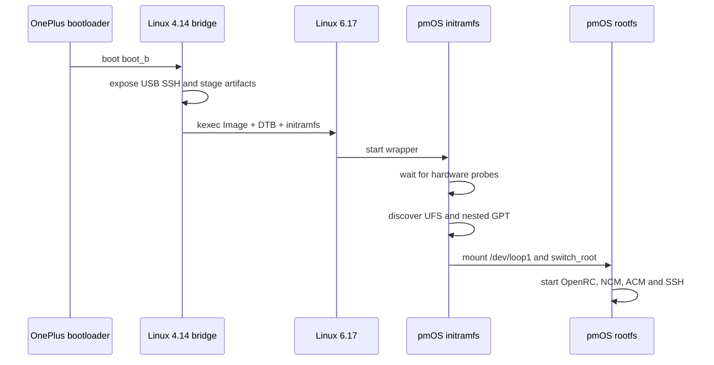

# Boot architecture

## Why a bridge is used

Directly booting the current Linux 6.17 Image through the OnePlus bootloader
has not produced the same reliable result as entering it through kexec. The
downstream 4.14 kernel already has working storage, USB, and enough display
support to provide a controlled launch environment.

The bridge separates two questions:

1. Can the OnePlus bootloader start the known downstream environment?
2. Can that environment transfer control to the mainline kernel?

The second path is now proven.

## Runtime sequence



## Persistent recovery behavior

The downstream bridge remains in `boot_b`. Mainline is loaded only into RAM.
If mainline resets, the bootloader starts the bridge again. Rescue watchers can
also restore a known image if fastboot or recovery becomes visible.

This design limits persistent writes during mainline experiments, but it is
not a substitute for verified stock partition backups.

## Mainline launcher

`scripts/test-mainline617-pmos-full.sh` is the public entry point for the
validated cycle. It:

1. checks the kernel, DTB, initramfs, and restore-image hashes
2. calls `scripts/test-mainline-via-kexec.sh`
3. verifies root access and `CONFIG_KEXEC` in the bridge
4. uploads and hash-checks the artifacts on the phone
5. loads the mainline kernel without writing a mainline image to a partition
6. arms the rescue watcher
7. executes kexec and waits for a new SSH boot ID

The default 120-second settle period is part of the current validated contract.
Changing it makes the artifact set experimental again.

## End state

On success:

```text
kernel: 6.17.0-sm8150
root:   /dev/loop1, ext4, read-write
boot:   /dev/loop0, ext2
USB:    NCM + ACM
SSH:    user@172.16.42.1
```

The panel may be black even when the system has fully booted. USB SSH is the
current source of truth for userspace success.
