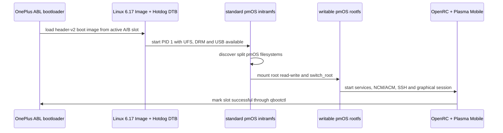

# Boot architecture

Last updated: 2026-08-28

## Current supported path

The physical HD1913 now boots the clean SM8150 Linux 6.17 stack
directly. The downstream 4.14 bridge and kexec are not executed.


```mermaid
sequenceDiagram
    participant BL as OnePlus ABL bootloader
    participant K as Linux 6.17 Image + Hotdog DTB
    participant IR as standard pmOS initramfs
    participant RF as writable pmOS rootfs
    participant UI as OpenRC + Plasma Mobile

    BL->>K: load header-v2 boot image from active A/B slot
    K->>IR: start PID 1 with UFS, DRM and USB available
    IR->>IR: discover split pmOS filesystems
    IR->>RF: mount root read-write and switch_root
    RF->>UI: start services, NCM/ACM, SSH and graphical session
    UI->>BL: mark slot successful through qbootctl
```

Validated properties include direct kernel entry, native UFS and ICE, writable
root, USB NCM/ACM/SSH, native DRM, accelerated Plasma Mobile, clean reboot,
bootloader/recovery selection and A/B success marking. The current laboratory
installation maps a split image from `userdata`;
the final pmaports installer must replace that layout without changing the
kernel/DTB hardware contract.

## Boot artifact contract

- Android boot header version 2
- arm64 Linux `Image`, source-built Hotdog DTB and external initramfs
- 4096-byte page size
- 96 MiB `boot` partition envelope with the validated AVB footer contract
- command line below the observed 511-character ABL limit
- matched kernel modules, firmware packages and DTB from the same build

The exact validated identities are versioned in
[package evidence](evidence/2026-08-03-mainline616-pmaports.md) and the
[v0.2.0-alpha.1 release notes](release-notes-v0.2.0-alpha.1.md), rather than
hard-coded here as if one historical hash were permanently current.

## Recovery and A/B behavior

Every candidate is written only after offline validation and complete readback.
A known-good slot/image, fastboot, pstore/ramoops and bounded Qualcomm crashdump
capture remain available. The tested ABL must not be trusted to fall back when
retry count reaches zero; successful boots must run `qbootctl` and recovery
must be independently supervised. Raw `RESTART2("bootloader")` and
`RESTART2("recovery")` now reach protocol-valid fastboot and the existing
root-ADB recovery, but a physical key path remains the independent fallback.
See [device safety](device-safety.md).

## Historical bridge path

The earlier investigation used:

```text
OnePlus bootloader -> downstream Linux 4.14 -> kexec Linux 6.17 K1
```

That path proved mainline userspace, provided early USB recovery and enabled
controlled comparison, but it is now historical. Its scripts and evidence are
retained for regression analysis only and must not become a dependency of a
release, pmaports submission or Ubuntu Touch port.

## Final shared-kernel path

The kernel endpoint is one upstream Hotdog implementation consumed by both
distributions:

```text
OnePlus bootloader -> upstream Linux + Hotdog DTB -> postmarketOS -> Plasma Mobile
OnePlus bootloader -> same Linux Image + DTB -> Ubuntu Touch -> Lomiri
```

Distribution-specific initramfs and userspace are allowed. Halium, Android
kernel modules, Android HALs, `libhybris`, binary DT mutation and kexec are not
part of the final hardware path.
