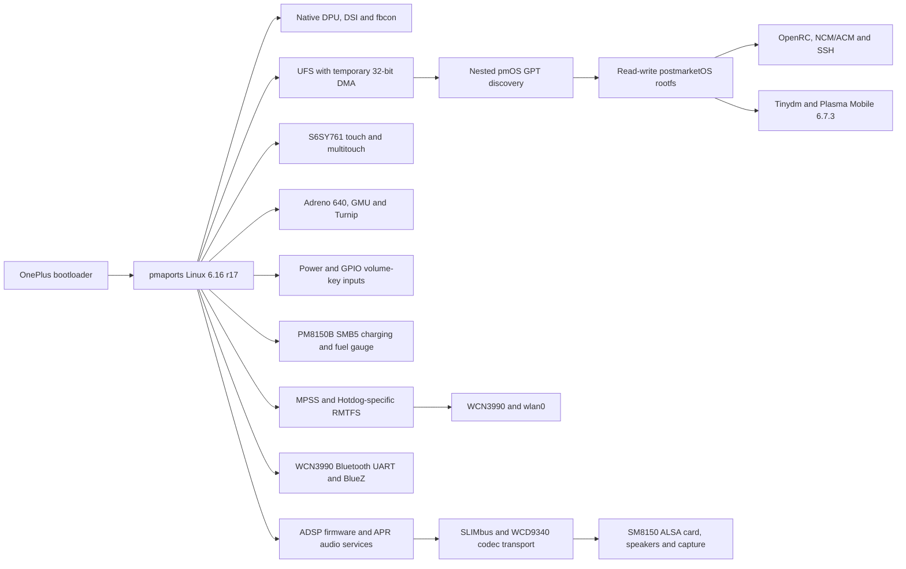

# Bring-up history and validation narrative

This document contains the detailed project-status narrative, boot-path notes,
recovery experiments, and validated mainline fixes that were previously kept in
the repository root `README.md`. The root README intentionally stays focused on
the current support state and navigation.

## Project status

Revision `r108` fixes normal software reboot on the direct mainline path. An
exact R107 full-RAM capture contained no Linux panic and showed shutdown reach
display teardown before firmware exposed Qualcomm `05c6:900e`. SM8150 was
missing the TCSR download-mode description already used by related Qualcomm
SoCs. Adding the `0x1fc0000` syscon and SCM offset `0x13000` makes the SCM
shutdown callback clear the physical `0x1fd3000` download cookie. Six
consecutive R108 software reboots returned to USB NCM and SSH without 900e.
See the [software-reboot evidence](evidence/2026-08-10-mainline616-software-reboot.md).

The complete Linux 6.16 image generated by the current pmaports device flow now
boots directly from the OnePlus bootloader. The exact package-built kernel,
source-built DTB, standard postmarketOS initramfs, and matching split rootfs
initialize the native SM8150 display, enumerate UFS, mount the root filesystem
read-write, complete `switch_root`, start OpenRC and `sshd`, and expose USB
networking. Verified SSH returned 18 seconds after reboot. This path does not
execute the downstream 4.14 kernel and does not use kexec; V43 remains a
recovery and comparison environment.

V32 isolated the former UFS failure to DMA addressability: the controller was
operational and consumed its doorbell, but an UTRL allocated above 4 GiB kept
`OCS=0xf` and received no response UPIU while UFS was running without the Apps
SMMU. V33 conditionally constrains coherent UFS DMA to 32 bits only for the
SM8150 host whose temporary bring-up DT omits `iommus`. With every other boot
component unchanged, the phone enumerated `/dev/sda`, discovered the nested
`pmOS_boot` and `pmOS_root`, and entered the real rootfs. See the
[direct mainline rootfs evidence](evidence/2026-08-03-direct-mainline-rootfs.md).
Large buffered Flatpak imports later exposed an abrupt `900e` boundary that is
not reproduced by direct-I/O stress. Full DDR captures showed that Linux had
allocated Flatpak page-cache folios inside stock-owned memory omitted from the
mainline DT. Revision `r22` completes all three missing HD1913 reservations.
Its exact-image hardware test direct-booted, passed a complete `boot_b`
readback, completed the formerly failing 3.7 GB pull and deployment, and ran
interactive 0 A.D. gameplay smoothly without a UFS error, Linux panic, or
Qualcomm transition. The exact
source-built `r22` package payload then direct-booted as
`#23-oneplus-hotdog-mainline616` and sustained a synchronized 6 GiB buffered
write plus a 180-second runtime observation. See the
[Flatpak/UFS evidence](evidence/2026-08-05-mainline616-flatpak-ufs.md).
The same published package directories also complete a clean strict rebuild
and assemble a filesystem-checked Plasma Mobile image from pinned pmaports.
Its 14,002,683,904-byte expanded image was written to the otherwise unused
`super` partition with direct I/O and read back to the exact host SHA-256 while
the accepted `userdata` system stayed online. The matching 96 MiB AVB image was
then fully read back from `boot_b` and direct-booted. Fresh SSH attested the
clean filesystem UUIDs, `super` loop backing, 1,523-package installation,
Plasma session, native 90 Hz KMS scanout, radios, inputs, and power supplies.
0 A.D. 0.28.0 subsequently launched from Discover and ran smooth interactive
gameplay on that same clean installation. See the
[public-image evidence](evidence/2026-08-05-mainline616-public-image.md).

Native display bring-up reached a second major boundary on 2026-08-03. V29
corrected the MSM DSI command-mode packetization for the panel's two 720-pixel
DSC slices, and V30 added the generated 128-byte DSC PPS sent by the downstream
driver after its vendor panel-on commands. V30 produces readable kernel and
postmarketOS output on the physical panel. V33 keeps that path while reaching
the real rootfs. Dense fbcon scrolling can appear repeated vertically, but
later physical KMS tests prove that this is console-specific: `kmscube`, Weston,
and Plasma Mobile scan out a correctly proportioned 1440x3120 surface. Revision
`r16` validates the stock HD1913 90 Hz timing in direct boot, and `r17` exposes
both stock 60 Hz and 90 Hz modes with working selection from Plasma Settings.
See the
[native display evidence](evidence/2026-08-03-native-display.md).

Direct USB networking and SSH now work from the bootloader-started mainline
kernel. V39 localized the last Qualcomm `900e` transition to the first EP0
transfer command. V40 attached DWC3 to Apps SMMU stream `0x140`, which stopped
the crash but left the event ring unwritten while the kernel requested a
passthrough domain. V41 changed only `iommu.passthrough=1` to `0`; DWC3 then
completed EP0 transfers, exposed NCM and ACM, and postmarketOS became reachable
at `172.16.42.1` over SSH. See the
[direct mainline USB evidence](evidence/2026-08-03-direct-mainline-usb.md).
V42 reproduces that result with the high-frequency EP0 trace removed and a
larger Terminus 16x32 console font. It reached verified SSH in 19 seconds; the
fbcon geometry changed from 180x195 to 90x97 characters as expected.
V43 closes the kernel-source cleanup step. It was rebuilt from pinned
ClearStaff commit `403b56c33e2c` plus the public patch series, with the builder
refusing any source delta under generic USB or IOMMU code. After a verified
write to `boot_b`, a normal reboot reached a fresh kernel, NCM, and SSH in about
15 seconds. No V37/V39 DWC3 diagnostics or unknown-endpoint events remained.
This proves that the temporary generic DWC3 changes used for localization are
not required once DWC3 uses its translated SMMU domain. V43 deliberately keeps
V42's validated DTB, initramfs, command line, and font byte-identical.

The `linux-oneplus-hotdog-mainline616` aport reproduces the V43 kernel contract
from pinned source through a strict pmbootstrap build. It generates the hotdog
DTB directly from DTS, builds the Image and modules, and rejects any payload
that violates the validated entry, memory, display, UFS, or DWC3 SMMU
invariants. A fresh current-pmaports tree assembles that package through the
normal device flow into a complete initramfs, header-v2 Android boot image, and
split `pmOS_boot`/`pmOS_root` filesystems. The generated command line is 397
bytes, keeps the translated DWC3 SMMU contract and the Terminus 16x32 console,
and explicitly removes the distro's quiet/Plymouth defaults. Two independent
AVB runs produced the same 96 MiB image, SHA256
`df87c5442859caeaeba08bfe2abb4f7b723437124b9764d9bf8d63b8be7a4fca`.
That exact image was written and read back from `boot_b`; the matching split
installation was staged with complete readback verification and then booted on
the HD1913. The resulting kernel reports `6.16.0-sm8150`, mounts the new pmaports
root UUID, and reaches stable NCM plus SSH.
See the [pmaports image evidence](evidence/2026-08-03-mainline616-pmaports.md).

Revision `r4` adds the first fully hardware-validated input peripheral. A
three-step DT-only localization enabled QUPv3 wrapper 2, its GPI DMA provider,
and the Samsung S6SY761 node with the HD1913 GPIO and regulator contract. The
exact `r4` APK kernel and DTB booted directly, returned USB SSH, and exposed
the controller as I2C `0-0048` and input `event1`. Taps, drags, pressure, and
multiple simultaneous contact slots produced live events. See the
[touchscreen evidence](evidence/2026-08-04-mainline616-touchscreen.md).

Revision `r5` enables the Adreno 640 and GMU using the existing upstream
SM8150 clock, power, interconnect, SMMU, OPP, and reserved-memory descriptions.
Two clean strict builds produced the same APK. Its exact kernel and DTB booted
directly from a fully read-back AVB image, exposed `/dev/dri/renderD128`, and
completed two Turnip Vulkan workloads without a GPU, GMU, or IOMMU fault. See
the [GPU evidence](evidence/2026-08-04-mainline616-gpu.md).

Revision `r6` was the first package to register both volume-key input devices,
but its original Volume Down path used PM8150 PON `RESIN`. Later physical
checks invalidated that mapping: pressing Volume Down changed neither the
real-time RESIN state nor its interrupt count. The current device tree maps
Volume Down to PM8150 GPIO7 and Volume Up to GPIO6. Both physical Volume Down
and Volume Up button operation are now hardware-validated and functional. The
original
[hardware-key evidence](evidence/2026-08-04-mainline616-volume-keys.md)
is retained as historical `r6` evidence and now also records the later final
GPIO mapping and physical validation. Key wake behavior and suspend/resume
remain separate open tests.

Revision `r7` is rebuilt directly from the accepted `r6` source and adds only
the PM8150B battery and charger device-tree description. Its package-generated
kernel and DTB direct-boot from AVB image
`dbc5210987b791774e67e7a6ad5fd796ecf950fca5ebe8e0a414f6112009c29f`,
return USB SSH, and expose `qcom-battery` plus `pm8150b-charger`. See the
[battery and charger evidence](evidence/2026-08-04-mainline616-battery-charger.md).
Direct register inspection then found that the driver applied SMB2 conversion
factors to SMB5 hardware, so `r7` is retained only as discovery evidence and
must not be used as a charging baseline.

Revision `r8` fixes that generation mismatch and leaves SMB5 charging and USB
input suspended until conservative limits have been programmed. Two strict
builds produced the same APK byte-for-byte. The exact package payload booted
from fully read-back AVB image
`32d5e2a4cea4d31c4200dbf6da82abfc7e2a25b717f3a3c7a017a688c3cf6376`.
Physical register reads confirmed 4.40 V float voltage, 1.50 A fast-charge
current, and a 500 mA USB input limit before and after a passing 180-second
trace. A second direct boot then completed 601 one-second runtime samples
through 716.96 seconds of uptime with UFS, rootfs, and USB gadget availability
preserved throughout. See the
[SMB5 parameter evidence](evidence/2026-08-04-mainline616-smb5-parameters.md).

The same long-running `r8` direct boot now validates the complete graphical
userspace path. `kmscube` renders on the physical panel at approximately 60
FPS through Mesa Freedreno `FD640`; Weston selects native DRM atomic modesetting
and maps the S6SY761 touchscreen to the correctly oriented `DSI-1` output.
The packaged postmarketOS Plasma Mobile 6.7.3 session then starts through
`tinydm`, presents a correct full-screen shell, accepts touch input, and remains
reachable over USB SSH. This establishes that the repeated dense fbcon output
is not a general panel geometry failure. The accepted baseline remains 60 Hz;
revision `r16` later validates a fixed stock 90 Hz mode without changing this
historical result. Revision `r17` later validates dynamic 60/90 Hz selection;
suspend/resume, repeated blank/unblank, and graphical cold boots remain open. See
the [graphical userspace evidence](evidence/2026-08-04-mainline616-graphical-userspace.md).

Revisions `r9` through `r13` bring up the WCN3990 and its MPSS dependency in
isolated steps. Revision `r12` restores Hotdog's device-specific RMTFS
reservation at `0xfc201000`; the direct-booted system then starts the modem
remote processor and keeps `rmtfs`, `tqftpserv`, QRTR, USB networking, and SSH
available. Revision `r13` changes only the fully described Wi-Fi node from
disabled to okay. Its exact package payload direct-boots as kernel build
`#14-oneplus-hotdog-mainline616`, exposes `wlan0` through `ath10k_snoc`, and
scans 2.4 GHz and 5 GHz networks. See the
[WCN3990 and MPSS evidence](evidence/2026-08-04-mainline616-wifi-mpss.md).

Revision `r14` then enables the WCN3990 Bluetooth UART and its handset power
rails without changing the accepted Wi-Fi and MPSS path. The direct boot reads
the real controller identity, and a diagnostic firmware alias lets BlueZ power
the controller and receive eight nearby devices. The handset subsequently
entered Qualcomm `900e`, so active Bluetooth was proven but stability remained
open. Revision `r15` selects the revision-21 firmware names directly and boots
as kernel build `#16-oneplus-hotdog-mainline616`. Scanning and real HID
connections work. One `r15` run entered `900e` at 275 seconds without a panic
or system-suspend entry, while subsequent Bluetooth-off and active-controller
600-second windows completed cleanly. Turning the connected controller off was
then followed by a separate 900-second clean window with the HCI idle and its
in-band sleep counters unchanged. See the
[Bluetooth evidence](evidence/2026-08-04-mainline616-bluetooth.md).

Revision `r16` selects the HD1913 stock 90 Hz panel command and vertical
timing recovered from the stock DTBO. Two independent strict builds produced
the same APK byte-for-byte. The exact AVB image was fully read back from
`boot_b`, direct-booted as `#17-oneplus-hotdog-mainline616`, and returned the
complete Plasma Mobile system. DRM debug state reports the active mode as
1440x3120 at 90 Hz with the expected 415457 kHz pixel clock. This first
hardware candidate intentionally exposes only 90 Hz; runtime 60/90 Hz mode
switching remains separate work. An unattended run kept the complete system
healthy through 919.76 seconds of uptime, then lost USB and blanked at the
15-minute idle deadline without entering a Qualcomm mode. Ramoops later proved
that PowerDevil requested `s2idle`, DWC3 failed to reach PHY L2, and S6SY761
failed its resume callback. A short power-button press restored the same boot
and USB SSH, but the system later entered `900e` without a Linux panic. Device
package `3-r5` therefore disables automatic suspend in all Plasma profiles
until resume is reliable; display blanking and explicit suspend remain
available. See the
[90 Hz display evidence](evidence/2026-08-04-mainline616-display-90hz.md)
and [idle-suspend policy](evidence/2026-08-05-mainline616-suspend-policy.md).

Revision `r17` exposes both stock modes and sends the corresponding panel
command during atomic mode changes. Scripted 60/90 Hz transitions and manual
selection in Plasma System Settings work on hardware. One blank/unblank cycle
produced a purple panel while Linux and USB SSH remained healthy; locking and
unlocking restored correct scanout. The remaining display issue is therefore
blank/unblank robustness, not mode availability. See the
[dynamic refresh evidence](evidence/2026-08-05-mainline616-dynamic-refresh.md).

Device package revision `3-r7` retains the reproducible Plasma Mobile
application set introduced in `3-r5`. Its install-if subpackage selects
Discover and its Flatpak
backend, a mobile browser, terminal, file manager, messaging and phone tools,
utilities, and `polkit-elogind` so the active local session can manage
NetworkManager. It installs conservative PowerDevil defaults that keep USB and
SSH available by avoiding automatic system suspend. Two strict builds produced
identical normalized metadata and the same installed configuration payload;
their APK archives differ only in generated timestamps and signatures. Revision
`3-r7` additionally makes `boot-deploy` wrap every generated hotdog boot image
in the validated 96 MiB AVB contract. A fresh 1,524-package image completed the
full install path and two final `mkinitfs` runs reproduced the same AVB image.
That packaging-only revision remains to be hardware-tested; the active clean
installation uses the otherwise equivalent `3-r6` device package.

An attempted live register comparison against R6 was stopped permanently after
the downstream `ufshcd_hold()` path timed out leaving hibern8 and entered a
broken vendor recovery path. The helper now fails closed. D16 instead uses the
normal R6 boot log plus the controller snapshot emitted by that timeout as its
passive downstream reference; see the
[R6 UFS incident record](evidence/2026-08-01-r6-ufs-live-probe.md).

Failed direct boots can now be diagnosed from Qualcomm `900e` without reading
phone storage. The host performs a bounded physical-memory read of the 4 MiB
ramoops reservation and extracts the persistent kernel console. This confirmed
that D11 completed all 986 initcalls, entered the postmarketOS initramfs, failed
the same UFS NOP, and reached its controlled 90-second panic. D12 reproduced
that controlled path while proving the HS-G3 runtime guard executed. D13 then
proved that the missing revision-2 lane values alone do not establish the link,
and D14 ruled out its attempted reset-order change as sufficient.

See [status.md](status.md) for the detailed support matrix and evidence.

## Validated boot path

The normal pmaports path no longer depends on the downstream bridge. The bridge
is retained only as a recovery and comparison tool while remaining hardware
support and upstream-quality integration are completed.

The tested OnePlus ABL does not provide a dependable unattended fallback to a
known-good A slot: after slot B reached retry count zero, firmware kept B active
and displayed the red failure screen instead of selecting successful slot A.
The PM8150 PON bootloader reason works from a mainline kexec boot, but D46-D48
did not make it a dependable pre-MMU recovery path. Current direct-boot tests
therefore keep a verified R6 restore image, place one candidate on slot B, and
classify the result from the display. The tested bounded-udev candidate armed
the APSS watchdog from PID 1 with the bootloader restart reason. That hardware
test reached the postmarketOS stage-two handoff, but its shell worker did not
return the phone to Fastboot after the logical deadline. The prepared follow-up
used the standalone static supervisor described above, reached
`setup_udev`, and likewise failed to expose Fastboot after the deadline. The
static fork/exec candidate gave the same aggregate 9/11 result. Its
per-command follow-up stopped at 7/11, isolating the first bounded `udevd`
launch. The udev-bypass follow-up reached 11/11 without exposing USB. The USB
prerequisite diagnostic reached 8/11, proving configfs availability and placing
the next boundary at UDC registration. Its DWC3 successor reached 7/11 because
D7 changed `/soc@0` from `#address-cells = 2`, `#size-cells = 2` to `1/1`.
That makes the unchanged four-cell mainline `reg` properties malformed and
explains why the expected `a6f8800.usb` platform entry was absent. The next
candidate uses the D3 no-op DTBO, whose offline application leaves the embedded
DTB byte-identical. It also builds the QCOM watchdog into the kernel, retains
the PM8150 Fastboot restart mode after initcalls, and packages the static rescue
supervisor. The resulting DWC3 wrapper and HS-PHY subtrees match the known-good
mainline kexec DTB property-for-property, and every driver needed to expose the
configfs NCM/ACM gadget is built into the exact candidate kernel.
A detached host supervisor still
restores and verifies R6 whenever Fastboot becomes visible.

D39 was reproduced unchanged with the original R6/B transaction, seven slot
retries, and a fixed logo for 90 seconds. Rebased D40 changes only the checkpoint
from entry 69 to entry 66 and also held at the fixed logo for 110 seconds. D41
changes only the checkpoint to entry 33; it reset repeatedly, exhausted the
slot-B attempts, and selected the working R6 image on slot A. The valid
unresolved range was therefore `subsys` entries 34-66. D42 held at the fixed
logo and did not reach its checkpoint after entry 49, narrowing that range to
entries 34-49. D43 reached its checkpoint after entry 41 and automatically
fell back to R6 on slot A, narrowing the range to entries 42-49. The search now
advances sequentially: D44 also reached its checkpoint after entry 42 and
returned through R6/A. D45, D46, and D47 then reached entries 43, 44, and 45.
D47 and D48 were restored directly to R6/B by the prearmed watcher, proving
entries 45 and 46 return. D49 then fell back to R6/A after entry 47 and was
recovered through software fastboot. D50 then proved entry 48 returns. Combined
with D42, this isolates entry 49, `raid6_select_algo`. A supervised follow-up
kept `CONFIG_RAID6_PQ=y`, disabled only `CONFIG_RAID6_PQ_BENCHMARK`, reached
the checkpoint after entry 49, and reset into R6/A. R6/B plus the stock DTBO
were then restored and read back exactly. The workaround is validated; the
underlying early timer behavior still needs diagnosis. A subsequent direct
candidate removed the checkpoint, retained the single-CPU and no-benchmark
workarounds, and added the entry-time watchdog clear that is stable through
kexec. It still held the fixed OnePlus logo for 480 seconds without USB or
SSH, proving that another direct-only blocker remains after the RAID6 fix.
The intervening one-try experiments are superseded because they
reached the red failure screen with slot B already at retry count zero and do
not prove checkpoint execution.

The direct-entry trace no longer depends on slot retry behavior or a working
kernel console. It first proved the MMU transition, `start_kernel()`, and
`paging_init()`. A later failure was traced to retaining an `early_memremap()`
pointer after `early_ioremap_reset()`. Replacing that pointer with the normal
arm64 linear mapping after `paging_init()` exposed the complete post-init row:
the global async wait returned, init memory was released, `kernel_execve()`
succeeded, and all three EL1-to-EL0 transition markers appeared. A PID 1-only
syscall row then showed a first syscall entry and return, a second syscall, and
at least 16 total syscalls.

That PID 1 trace also exposed an Android boot-image contract issue. The tested
HD1913 bootloader ignores header-v2 `extra_cmdline` and copies only 511
characters from the primary 512-byte field. The diagnostic `rdinit=` token had
been stored beyond that boundary, so Linux correctly ran the original
postmarketOS `/init` instead of the static wrapper. The direct-image builder now
rejects longer command lines, and the next hash-pinned candidate places every
boot-critical token in the accepted field. Exact hashes and marker meanings are
recorded in the
[2026-07-30 direct PID 1 evidence](evidence/2026-07-30-direct-pid1.md).

Persistent `boot_b` testing on 2026-07-12 established a working R5 rescue
baseline and three negative mainline handoff results. D1 AVB
`f8e83ae15cb016612433b8a2d800d828b025d56c76640a2ebb41a3061baf8994`
and D1-pack AVB
`2f3bf9b7cde3b2d48a3cf4d6fe2fb2f92e210e1a6b1249505fa15be10c26b754`
plus D2 header-v0 AVB
`2076c16598a63bfcfea416b47789eacf74086e33919c0715949cd42719f9b71e`
were each written and read back exactly before reboot, then returned to real
fastboot USB without an observed mainline USB identity. R5 was restored and
verified after each cycle. These controls exclude the tested boot-header and
DTB-placement variants, but do not identify the exact early failure boundary.

Offline overlay analysis found that the stock `dtbo_b` entry selected for this
hardware applies to the downstream DTB but fails against the K1 DTB with
`FDT_ERR_NOTFOUND`. D3 preserved the DTBO table and replaced only that overlay
with a no-op while booting unchanged D1. Raw host USB shows fastboot returning
3.84 seconds after disconnect, matching D1/D2. Its rollback restored and read
back original `dtbo_b` before exact R5 `boot_b`. D3-wdt and D4-entry produced
the same interval. The R5 control then proved the no-op DTBO itself is not a
valid baseline. D5 retained 56 fragments and applied cleanly to both DTBs; R5
reached its telnet initramfs but failed to mount the nested filesystems. D6
added K1 aliases for the vendor UFS symbols, retained 58 fragments, exposed all
UFS LUNs and USB ACM, then stalled during `pmos_continue_boot`; a repeat entered
Qualcomm `900e` crashdump mode. D7 retains the complete vendor UFS fragments
through an always-on fixed-regulator bridge for `ufs_phy_gdsc`. With unchanged
R5 it reached a fresh SSH boot on hardware, and strict readback confirmed the
R5 boot image plus D7 DTBO exactly. D8 then returned to fastboot after about
26 seconds; offline replay proved its embedded DTB could not accept D7. D9
embeds the corrected bridged DTB. The rollback environment is now R6 with the
stock DTBO: it reached fresh SSH with `watchdog_v2.enable=0`, and strict
readback matched both images exactly. See the
[2026-07-12 direct-boot evidence](evidence/2026-07-12-direct-boot.md) and
[2026-07-15 RAID6 checkpoint evidence](evidence/2026-07-15-raid6-direct-boot.md),
the [K1 userspace evidence](evidence/2026-07-15-k1-kexec-userspace.md),
plus the [controlled test matrix](direct-boot.md).

## Mainline fixes validated so far

The V43 kernel is rebuilt from the pinned public source and patch series. Its
controlled device tree and userspace still carry these bring-up changes:

1. Reserve the firmware-owned `0x89d00000-0x8b700000` memory gap as `no-map`.
2. Keep selected QUP clients on the temporary SMMU bypass and omit the failing
   UFS ICE dependency. The accepted `r17` baseline bypasses UFS and constrains
   DMA below 4 GiB; `r18` and later restore UFS stream `0x300`, while `r19` and
   later also retain the 32-bit aperture.
3. Keep DWC3 attached to Apps SMMU stream `0x140` and use a translated domain
   with `iommu.passthrough=0`. An identity domain left the event ring unwritten.
4. Enable the native DPU/DSI/DSC panel path and built-in Terminus 16x32 fbcon.
5. Discover the postmarketOS GPT nested inside Android `super`, then expose and
   mount its boot and root filesystems through loop devices.
6. Keep the boot image command line at 511 characters or fewer because the
   tested ABL drops byte 512 and ignores header-v2 `extra_cmdline`.

V43 contains no local modifications to generic DWC3, USB gadget, or IOMMU
source. Its DTB and initramfs remain controlled V42 artifacts. The new 6.16
reference aport removes the prebuilt-DTB dependency, and the normal pmaports
flow now assembles the kernel, source DTB, initramfs, and split installation.
The SMMU bypasses, ICE removal, device-specific kernel package, debug command
line, coherent rootfs installation, and final hardware validation still need
to be resolved before submission.
The technical evidence and rationale are documented in
[mainline-bringup.md](mainline-bringup.md).
