# Roadmap

Last updated: 2026-08-13

## Final objective

The final objective is complete, maintainable OnePlus 7T Pro (`hotdog`)
support in upstream Linux and two fully usable distribution paths built on the
same mainline kernel support:

- a maintained mainline Linux kernel whose generally useful drivers, bindings,
  Qualcomm fixes, and Hotdog device tree are accepted by the relevant
  `torvalds/linux` subsystem maintainers;
- complete hardware support for the HD1913 test handset;
- a clean, maintainable `pmaports` submission;
- a normal postmarketOS installation and upgrade path;
- a 100% functional Plasma Mobile/postmarketOS userspace with no
  laboratory-only boot steps;
- a mainline-native Ubuntu Touch port with a normal installation, recovery,
  OTA, and upgrade path;
- a 100% functional Lomiri session using standard Linux interfaces directly,
  without Halium, an Android kernel, an Android HAL, `libhybris`, or a
  downstream/kexec bridge.

The required Ubuntu Touch boot chain is:

```text
OnePlus ABL/bootloader
  -> mainline Linux Image + upstream Hotdog DTB
  -> Ubuntu Touch root filesystem and native system services
  -> Lomiri/Mir on DRM/KMS, Mesa, libinput, ALSA/PipeWire and standard Linux APIs
```

The kernel source, config fragments, DTB, drivers, and firmware contract must
be shared by postmarketOS and Ubuntu Touch. Distribution-specific boot images
may contain different initramfs and command lines, but they must boot the same
kernel `Image` and DTB without a compatibility kernel or hardware abstraction
layer in between. Proprietary redistributable firmware may be loaded by normal
upstream Linux drivers; Android kernel modules and HAL binaries are not part of
the supported path.

The project is not complete when an image merely boots. Each subsystem must be
hardware-tested, integrated into both applicable normal package flows,
documented, and retested after the shared kernel and device packages are
cleaned up. The postmarketOS goals already documented in this repository remain
requirements; Ubuntu Touch/Lomiri is an additional deliverable, not a
replacement.

## Completion and status contract

Every real Hotdog function recorded as `Partial`, `Broken`, `Not working`,
`Not yet supported`, `Pending`, or equivalent in any project status document is
an active roadmap item whose required next functional state is `Working`.
Those labels are not acceptable terminal states. A function may be removed
from the working queue only when the tested handset does not contain the
hardware, or when a documented physical/legal impossibility is reviewed and
recorded as `Not applicable`; difficulty, missing upstream code, proprietary
Android implementation, or lack of current tests is not sufficient.

Status claims remain evidence-based. This roadmap does **not** relabel an
untested or broken function as working. Each functional item progresses through
the following gates:

1. **Working**: the feature succeeds on the HD1913 through a standard Linux API
   with a reproducible hardware test and no manual register pokes.
2. **Stable**: it survives repeated cold boots, suspend/resume, error recovery,
   and relevant stress or long-duration tests.
3. **Upstream-ready**: the implementation is split by subsystem, contains no
   laboratory workaround, passes the subsystem's checks, and has public
   evidence and regression results.
4. **Upstreamed/integrated**: kernel work is accepted through the relevant
   maintainer tree, while firmware, Mesa, libcamera, ALSA UCM, ModemManager,
   Lomiri, postmarketOS, and Ubuntu Touch work is accepted in its own upstream.

`Working` is therefore the minimum outcome for every supported function;
`Stable` and the appropriate upstream/integration state are the completion
outcome. The [hardware status matrix](status.md) remains the factual record of
what has actually passed, and the [hardware enablement roadmap](hardware-roadmap.md)
remains the experiment-level record.

### Full coverage register

The following register prevents partial successes from hiding unfinished
parts of the same subsystem. It incorporates all existing goals and all current
non-working or partially working areas.

| Domain | Required `Working` closure |
|---|---|
| Boot and recovery | Direct A/B boot, first install, boot success marking, reboot, poweroff, bootloader and recovery modes, pstore/ramoops, watchdog, rollback, and rescue all work without kexec or laboratory wrapping. |
| Mainline kernel/package | A current supported mainline baseline and shared SM8150 config build reproducibly; the exact kernel, DTB, modules, and firmware package installed on the phone match. |
| Device tree and SoC | Hotdog DTS is schema-valid; CPUs, OPP/cpufreq, idle, clocks, regulators, interconnects, power domains, remoteprocs, reserved memory, SMMUs, DMA, and all populated board peripherals are accurately described. |
| Memory and storage | Full RAM map, UFS, UFS ICE, inline crypto where supported, TRIM, filesystem integrity, normal partition/install layout, encryption, and sustained I/O work without DMA/SMMU bypasses. |
| Internal display | DPU/DSI/DSC/panel, brightness, blank/unblank, correct 60/90 Hz atomic switching, color/orientation/scaling, and repeated suspend/resume work without DSI errors or abnormal scanout. |
| GPU and video | Adreno/GMU, OpenGL ES, Vulkan, accelerated Lomiri/Plasma scanout, thermal control, suspend/resume, Venus decode/encode, and zero-copy playback work under sustained load. |
| Touch and physical input | All touch slots, power and volume keys, alert slider, wake gestures where supported, Hall inputs, orientation, and on-screen keyboard integration work before and after suspend. |
| USB device/debug | NCM and interactive ACM, USB 2/3 device mode, role switching, recovery after host mode, and standard file/debug functions work without losing the rescue channel. |
| USB host and dock | Powered and unpowered host mode, safe VBUS source, USB 3, storage, Ethernet, HID, hotplug, PD charging, DP Alt Mode, valid mode pruning, external-display layout, DP audio, and docked suspend work. |
| Wi-Fi and Bluetooth | Stable factory identities, both Wi-Fi bands, throughput, roaming/AP where supported, BlueZ pairing/HID/BLE/A2DP/HFP, coexistence, rfkill, power management, and reconnect after suspend work. |
| Audio | ADSP/codec/amps, both speakers, earpiece, every physical microphone, safe gains/protection telemetry, capture volume, USB-C/headset detection, Bluetooth audio, DP audio, ringtone, calls, echo cancellation, UCM, and normal application routing work. |
| Modem and telephony | MPSS lifecycle, IPA/rmnet, SIM/PIN, registration, LTE data/APN, SMS, USSD, calls, in-call audio, speakerphone, airplane mode, suspend/reconnect, emergency-call architecture, and VoLTE/IMS where deployable work through maintained services. |
| GNSS/location | QMI location sessions are bridged into the standard location service; GPS and advertised constellations, A-GPS, application permissions, cold/warm fixes, and suspend power policy work. |
| Cameras | All four sensors, CAMSS/CCI, regulators/clocks, EEPROM/calibration, AE/AWB/AF, actuators/OIS where present, flash, reliable pop-up/Hall/fall-safety lifecycle, recovery without reboot, libcamera, video, color, and mobile camera apps work. |
| Sensors and range | SLPI and/or direct IIO drivers expose accelerometer, gyroscope, magnetometer, light, proximity, Hall, motion/step events, rotation fusion, calibration persistence, portals, and the STMVL53L1 rangefinder across suspend. |
| NFC | PN553/NCI reader and tag discovery, clean down/up recovery, firmware/config provenance, suspend/wake, and secure-element/HCE functions that can be provided without uncertified payment claims work through maintained Linux userspace. |
| Haptics and LEDs | AW8697 vibration strength, stop/restart, repeated force-feedback, feedbackd/Lomiri feedback, camera dual-tone flash, and all present indicators work with safe limits. |
| Battery, charging and thermal | Accurate gauge/health/temperature, safe USB/PD/Warp charging where supportable, cable/termination/low-battery/off-mode transitions, JEITA limits, CPU/GPU/PMIC/modem thermal zones, throttling, profiles, and long-duration stability work. |
| Suspend and power | `s2idle`, display/touch/radio/audio/storage suspend, wake sources, RTC alarm, charger wake, low idle drain, and repeated full-system suspend/resume work without manual recovery. |
| Fingerprint and security | Sensor transport/power/firmware, UDFPS illumination, enrollment/authentication, lock-screen integration, a reviewed security model, HWRNG, hardware crypto, storage encryption, and stable device identities work without unsafe trust bypasses. |
| postmarketOS/Plasma | Clean pmaports install, upgrade and recovery plus udev, firmware, networking, telephony, audio, camera, sensors, power, feedback, localization, application confinement and Plasma Mobile work without manual bring-up commands. |
| Ubuntu Touch/Lomiri | Clean native install, recovery and OTA plus systemd/udev, Mir/Lomiri, graphics, input, networking, telephony, audio, cameras, sensors, power, feedback, location, application confinement and updates work on the same mainline kernel without Halium. |

## Timeline and current position

This timeline records validated project milestones, not merely commits or
successful builds. Future entries are dependency-ordered stages, not calendar
promises. The detailed limitations of every completed milestone remain in
`status.md` and the linked evidence records.

```mermaid
timeline
    title OnePlus 7T Pro mainline bring-up — validated progress and remaining path
    section Boot foundation
      2026-07-09 : Bring-up workspace and guarded recovery baseline
      2026-07-11 : Mainline kexec userspace and reproducible kernel package
      2026-07-15 : Direct-entry failure isolated to kernel initialization
      2026-07-30 : Direct mainline reaches PID 1 and initramfs
      2026-08-01 : Native UFS path brought up
    section Usable mainline phone
      2026-08-03 : OnePlus bootloader to Linux 6.16 to writable postmarketOS
                 : Native display, USB NCM, SSH and exact pmaports image validated
      2026-08-04 : Touch, Adreno 640, Plasma Mobile, Wi-Fi and Bluetooth validated
      2026-08-05 : Full RAM reservations survive pressure and clean public image boots
                 : Dynamic 60/90 Hz and both internal speakers validated
      2026-08-07 : Handset microphone, USB-C host, USB 3, DisplayPort and fuel gauge
      2026-08-09 : Telephoto and main-camera capture plus focus
      2026-08-10 : All four cameras and automatic pop-up lifecycle
                 : Clean reboot, A/B success marking and Alpha 1
    section Current frontier
      2026-08-12 : IPA v4.1 and rmnet_ipa0, NFC target detection and physical haptics
                 : Modem responds without SIM and SLPI sensor service is published
      2026-08-13 : YOU ARE HERE — SMB5 v3 validated
                 : Active work on SLPI sensor registry and standard sensor exposure
                 : Mainline review follow-up and partial/broken closure remain active
    section Remaining hardware and upstream
      Next : Finish sensors, GNSS integration, NFC lifecycle and haptics userspace
      Then : Telephony, audio endpoints, suspend, charging, dock and camera quality
      Then : Fingerprint, security, UFS ICE and complete SoC/SMMU cleanup
      Then : Upstream Linux acceptance and clean pmaports release
    section Native Ubuntu Touch
      After shared kernel : Agree mainline-native UBports architecture
      Then : Boot Ubuntu Touch directly on the same Image and DTB
      Then : Enable Lomiri and every hardware service without Halium
      Final : Cross-distribution acceptance with every real function Working and Stable
```



### Completed milestone ledger

| Date | Validated milestone | Evidence |
|---|---|---|
| 2026-07-11 to 2026-07-30 | Kexec reference userspace, guarded direct-entry diagnostics, kernel initialization bisection, direct PID 1 and initramfs handoff. | [K1 userspace](evidence/2026-07-15-k1-kexec-userspace.md), [direct PID 1](evidence/2026-07-30-direct-pid1.md) |
| 2026-08-01 | Native UFS calibration and direct storage path established. | [Native UFS](evidence/2026-07-31-direct-native-ufs.md) |
| 2026-08-03 | The OnePlus bootloader directly starts the mainline-oriented kernel; writable postmarketOS root, native display, USB networking, SSH and package-generated image all pass on hardware. | [Rootfs](evidence/2026-08-03-direct-mainline-rootfs.md), [USB](evidence/2026-08-03-direct-mainline-usb.md), [pmaports image](evidence/2026-08-03-mainline616-pmaports.md), [display](evidence/2026-08-03-native-display.md) |
| 2026-08-04 | S6SY761 touch, Adreno 640/Turnip, accelerated Plasma Mobile, WCN3990 Wi-Fi, Bluetooth HID and a physical 90 Hz mode pass their initial hardware tests. | [Touch](evidence/2026-08-04-mainline616-touchscreen.md), [GPU](evidence/2026-08-04-mainline616-gpu.md), [graphics](evidence/2026-08-04-mainline616-graphical-userspace.md), [Wi-Fi](evidence/2026-08-04-mainline616-wifi-mpss.md), [Bluetooth](evidence/2026-08-04-mainline616-bluetooth.md), [90 Hz](evidence/2026-08-04-mainline616-display-90hz.md) |
| 2026-08-05 | Correct stock-owned RAM reservations survive the former pressure crash; a clean public image boots; dynamic refresh, WCD9340/ADSP and both internal speakers work. | [RAM/UFS pressure](evidence/2026-08-05-mainline616-flatpak-ufs.md), [public image](evidence/2026-08-05-mainline616-public-image.md), [dynamic refresh](evidence/2026-08-05-mainline616-dynamic-refresh.md), [speakers](evidence/2026-08-05-mainline616-internal-speakers.md) |
| 2026-08-07 | The handset microphone, dual-role USB-C, powered-dock host mode, SuperSpeed, DisplayPort video, corrected volume keys and fuel gauge reach hardware validation. | [Microphone](evidence/2026-08-07-mainline616-microphone.md), [USB role](evidence/2026-08-07-mainline616-usb-role.md), [hardware survey](evidence/2026-08-07-mainline616-remaining-hardware.md) |
| 2026-08-09 to 2026-08-10 | Telephoto, main, ultra-wide and front cameras capture through libcamera; rear focus works; the pop-up camera extends and retracts automatically around capture. | [Telephoto](evidence/2026-08-09-mainline616-camera-telephoto.md), [IMX586](evidence/2026-08-09-mainline616-camera-imx586.md), [autofocus](evidence/2026-08-10-mainline616-camera-autofocus.md), [IMX481](evidence/2026-08-10-mainline616-camera-imx481.md), [IMX471/pop-up](evidence/2026-08-10-mainline616-camera-imx471-popup.md) |
| 2026-08-10 | Clean software reboot passes six cycles, slot success is marked correctly, GNSS QMI sessions work at engine level and the first public Alpha pair boots on the HD1913. | [Reboot](evidence/2026-08-10-mainline616-software-reboot.md), [A/B](evidence/2026-08-10-ab-slot-success.md), [GNSS](evidence/2026-08-10-gnss-qmi-loc.md), [Alpha 1](evidence/2026-08-10-v0.1.0-alpha.1.md) |
| 2026-08-11 to 2026-08-12 | Initial upstream series are published and audited; IPA v4.1 creates `rmnet_ipa0`; NFC detects a real ISO 14443-4 target, although payload reading remains incomplete; AW8697 vibrates on hardware; modem services answer without a SIM; SLPI publishes the Snapdragon Sensor Core service. | [Upstream follow-up](evidence/2026-08-12-upstream-follow-up.md), [IPA scope](evidence/2026-08-12-ipa-v41-scope.md), [NFC](evidence/2026-08-10-nfc-nxp-nci.md), [haptics](evidence/2026-08-11-haptics-aw8697.md), [SLPI](evidence/2026-08-10-slpi-sensor-dsp.md) |
| 2026-08-13 | The upstream-oriented SMB5 v3 candidate passes guarded charge and VBUS transition tests; writable Hexagon file service and sensor-registry work advance the active SLPI bring-up. | [SMB5 v3](evidence/2026-08-13-smb5-v3-hardware-validation.md), [Hexagon writes](evidence/2026-08-13-hexagonrpcd-write.md) |

### Current checkpoint

The project is past basic boot and broad peripheral discovery. A useful
mainline postmarketOS/Plasma system exists, but it is not yet a complete or
upstream-clean phone. The active engineering frontier on 2026-08-13 is:

- completing SLPI/SSC sensor discovery and exposing real motion, orientation,
  light and proximity data through standard Linux interfaces;
- turning the new IPA/rmnet foundation into normal GNSS and mobile-data
  services, then validating the modem with a SIM;
- closing every incomplete baseline item in phase 0, especially suspend,
  UFS ICE, display resume, remaining audio endpoints and dock behavior;
- revising and submitting the Linux patch tracks until maintainer acceptance.

Ubuntu Touch/Lomiri without Halium is an explicit final objective, but no
Ubuntu Touch image or Lomiri session has been implemented or validated yet.
Its work begins at phase 15 after the shared-kernel contract is sufficiently
stable to avoid creating a second device-specific kernel stack.

## Current state

The public Linux 6.16 reference stack already direct-boots the physical HD1913
from the OnePlus bootloader, mounts a writable postmarketOS root filesystem,
starts OpenRC, exposes USB networking and SSH, and runs Plasma Mobile.

The following are currently working or hardware-validated:

- direct boot, persistent storage, clean software reboot, and recovery paths;
- native 1440×3120 display at stable 60 Hz, with 90 Hz mode selection working
  but wake reliability still incomplete;
- Adreno 640 acceleration through Freedreno/Turnip;
- S6SY761 touchscreen, Power, Volume Up, and Volume Down;
- basic Wi-Fi association and Bluetooth HID connectivity;
- internal stereo speakers and the handset microphone through packaged audio
  profiles;
- USB-C host mode, USB 3, and DisplayPort video output;
- battery fuel-gauge reporting;
- capture from all four cameras through libcamera and Plasma Camera;
- automatic IMX471 pop-up extension, capture, and retraction;
- the SM8150 IPA v4.1 path and `rmnet_ipa0`, with modem QMI services answering
  on a handset that currently has no SIM inserted;
- GNSS engine sessions over QMI and real NFC target detection, while their
  complete standard userspace paths remain unfinished;
- physical AW8697 vibration and the guarded SMB5 v3 charge/VBUS candidate;
- SLPI boot, FastRPC attachment, writable sensor-registry service and the
  published Snapdragon Sensor Core service, before individual sensors are
  exposed.

The remaining support gaps are tracked explicitly in
the [hardware status matrix](status.md). Camera capture is working, but AF/AE/AWB
convergence, touch-to-focus, production color calibration, and broader camera
application testing remain final camera-quality work. The ordered hardware
queue below starts with GNSS after the camera capture milestone.

## Ordered execution plan

### 0. Close every current partial, broken, or unvalidated baseline item

This closure queue is mandatory even when later phases depend on it. It is
derived from `status.md`; newly discovered partial or broken items must be added
here or to the appropriate numbered phase rather than left only in an evidence
note.

| Current incomplete area | Gate to `Working` |
|---|---|
| K1/shared kernel package | Hardware-test reproducible current-mainline builds, then retire K1 in favor of the shared SM8150 package. |
| Device tree | Replace SMMU, ICE, DMA, reserved-memory and overlay workarounds with source DTS accepted by schema and hardware regression tests. |
| USB ACM | Complete interactive bidirectional serial sessions across reboot and recovery, not enumeration alone. |
| DRM/panel | Fix 90 Hz blank/unblank and resume; make repeated atomic 60/90 transitions reliable while retaining 60 Hz as the safe default until then. |
| GPU | Pass sustained mixed graphics/video load, repeated cold boot and suspend/resume without GMU, IOMMU or scanout faults. |
| Apps SMMU | Attach and validate every applicable client independently, with translated domains and no global or device-specific bypass. |
| UFS ICE (`Not working`) | Fix clocks, power, probe order and SMMU integration; validate encrypted and unencrypted storage plus repeated read-write root boots. |
| Kernel modules | Install the module tree built with the running kernel package and prove ABI/artifact identity; eliminate the r25/r26 split. |
| Suspend (`Broken at devices`) | Fix S6SY761 reset/resume, then pass every `pm_test` level and repeated real `s2idle` with all enabled peripherals. |
| Reboot modes | Validate direct bootloader, recovery, system reboot and poweroff paths with pstore and A/B recovery prepared. |
| Touch and keys | Validate all contact slots, wake behavior, power/volume keys and alert slider across blanking and suspend. |
| Firmware | Resolve source, licence, redistribution, checksums and ownership for every shipped payload; runtime-test each payload's consumer. |
| Wi-Fi | Recover the factory MAC, pass sustained dual-band traffic, rfkill, AP/roaming where supported and suspend/resume. |
| Bluetooth | Pass repeated pair/disconnect/reconnect, BLE, HID, A2DP/HFP, coexistence and suspend without unexplained Qualcomm transitions. |
| Cameras | Complete CAMSS recovery, AE/AWB/AF convergence, touch focus, calibration, video, flash, OIS where present and broad app testing for all four sensors. |
| Charging/battery | Validate cable transitions, termination, low state of charge, JEITA/thermal limits, off-mode behavior, long runs, suspend and safe fast-charge capability. |
| USB-C/dock | Validate safe unpowered VBUS, HID/Ethernet/storage, hotplug, device-mode recovery, supported DP lane/mode pruning, DP audio and docked suspend. |
| postmarketOS packaging | Remove nested GPT, manual AVB/recovery assumptions, debug policies and one-off services; validate normal install, update and rollback. |

Exit criterion: none of the above remains described by a partial/broken/pending
qualification in `status.md`. Passing this phase does not remove the broader
feature work below; it closes the incomplete portions of features already
claimed at a basic runtime level.

### 1. GNSS / location

| Subsystem | Function | Current state |
|---|---|---|
| GNSS | Location | Engine answers QMI. The IPA dependency is cleared: `rmnet_ipa0` exists and ModemManager holds a net port. |

The modem's GNSS engine works. With `pd-mapper` started, the LOC service answers
over QRTR: NMEA types are readable and location sessions start and stop cleanly.
The rest of the modem answers too, reporting its revision, signal strength, and
that no SIM is inserted.

The former IPA blocker is now cleared locally: the SM8150 IPA v4.1 platform
data, binding and device description bring up `rmnet_ipa0`, and ModemManager
holds the net port. What remains is to turn the working QMI location engine and
rmnet transport into the standard location-service path, validate real fixes
and application coordinates, and upstream the generic IPA support. A direct
QMI backend for `gnss-share` remains an alternative only if the normal modem
integration cannot provide location cleanly. See the
[GNSS QMI evidence](evidence/2026-08-10-gnss-qmi-loc.md).

Exit criterion: a repeatable fix is available through the normal postmarketOS
location stack after boot and resume.

### 2. Sensors

| Subsystem | Function | Current state |
|---|---|---|
| Sensors | Motion / rotation / proximity | SLPI boots, FastRPC attaches, writable registry requests work and the Snapdragon Sensor Core service is published. Individual physical sensors are not exposed yet. |

Finish the SSC protocol discovery from the now-running sensor domain, enumerate
the physical sensor SUIDs and attributes, add the smallest maintainable bridge
to standard IIO interfaces, and integrate orientation, proximity, light and
motion into Plasma Mobile. Preserve the packaged protection-domain maps,
firmware and registry service without depending on an Android sensor HAL.

Exit criterion: accelerometer, gyroscope, magnetometer, light, proximity, and
the relevant motion events work through standard Linux interfaces and survive
repeated boots.

### 3. NFC

| Subsystem | Function | Current state |
|---|---|---|
| NFC | NFC / secure-element path | PN553 controller, board RF configuration, polling and detection of a real ISO 14443-4 target are hardware-validated; payload reading, clean lifecycle and secure-element support remain open. |

Complete target payload exchange and reader-mode userspace, fix explicit
down/up recovery without reboot, package only redistributable configuration,
and document secure-element and payment limitations separately.

Exit criterion: NFC tag detection and reader operation work in userspace, with
any secure-element limitation explicitly documented.

### 4. Haptics

| Subsystem | Function | Current state |
|---|---|---|
| Haptics | AW8697 | Controller identity, wiring, source-built `FF_RUMBLE` driver and physical vibration are hardware-confirmed; feedbackd and full behavior validation remain open. |

The controller answers at `0x5a` with chip ID `0x97`; the stock tree identifies
GPIO 116 as reset, GPIO 24 as interrupt, and the HD1913 as the 170 Hz actuator
profile. The initial driver uses continuous mode and the normal OxygenOS drive
limit without requiring proprietary effect firmware. Physical vibration now
passes; next validate low-strength and full-strength pulses, repeated
stop/start behavior and input force feedback, then connect it to feedbackd
without making vibration dependent on a vendor Android service.

Exit criterion: notification and user-interface haptics work repeatedly through
the normal postmarketOS feedback stack.

### 5. Range sensor

| Subsystem | Function | Current state |
|---|---|---|
| Range sensor | STMVL53L1 laser rangefinder | Driver/integration work remains. |

Confirm the I2C address, interrupt, regulators, and calibration data. Bring up
the STMVL53L1 through an appropriate mainline interface and integrate it with
the proximity or sensor service where appropriate.

Exit criterion: range measurements are stable, exposed through a standard
interface, and safe across suspend and resume.

### 6. Fingerprint

| Subsystem | Function | Current state |
|---|---|---|
| Fingerprint | In-display fingerprint reader | Plasma/fprintd can provide the userspace authentication path; Hotdog still needs sensor/firmware integration and UDFPS display-illumination coordination. |

Identify the reader, vendor firmware, transport, TEE dependency, and display
illumination sequence. Implement the smallest maintainable integration possible,
and keep enrollment, authentication, suspend, and lock-screen behavior separate
in the test matrix.

Exit criterion: enrollment and unlock work through fprintd/Plasma, including
the required display illumination, or every unsupported vendor dependency is
proven and documented rather than hidden behind an Android HAL.

### 7. Telephony and mobile data

MPSS, QRTR/RMTFS, IPA v4.1 and `rmnet_ipa0` are present. The modem reports its
revision and signal state through QMI on hardware, but the tested phone has no
SIM inserted, so registration, data, SMS and calls are not yet validated.

Complete the modem path in this order:

1. modem enumeration and firmware lifecycle;
2. SIM detection and PIN handling;
3. LTE data through ModemManager and NetworkManager;
4. SMS send and receive;
5. voice calls and in-call audio;
6. VoLTE/IMS only if the hardware and upstream userspace make it practical.

Exit criterion: SIM, data, SMS, and calls work through normal postmarketOS
services without losing USB recovery or breaking suspend.

### 8. Audio completion

The internal stereo speakers and handset microphone are working. The remaining
audio work is to finish the physical endpoints and normal application path:

- earpiece speaker;
- wired USB-C/headset paths and detection;
- remaining analogue and digital microphones;
- capture volume and protection telemetry;
- echo cancellation and noise-reduction policy;
- DisplayPort audio;
- complete ALSA UCM and PipeWire/WirePlumber profiles.

Exit criterion: playback, capture, calls, earpiece, headphones, speakerphone,
and external-display audio work through normal Plasma applications with safe
power-down and conservative gain defaults.

### 9. Power, charging, thermal, and suspend/resume

The fuel gauge and conservative charger limits are working. The upstream-shaped
SMB5 v3 candidate also passes guarded 180-second and 600-second charge runs,
host USB authorization changes and a physical VBUS cable cycle. Charge
termination, low-battery behavior, thermal policy and full suspend remain
incomplete, and the touchscreen resume failure currently blocks reliable
system suspend.

Complete this phase in dependency order:

1. touchscreen reset and resume;
2. display blank/unblank and touch wake;
3. `s2idle` and repeated suspend/resume with USB, Wi-Fi, Bluetooth, and audio;
4. charging transitions, termination, low-battery behavior, and Warp/USB limits;
5. thermal zones, throttling, and sustained CPU/GPU workloads;
6. stable dynamic 60/90 Hz behavior after wake.

Exit criterion: the handset can suspend, resume, charge, throttle, and recover
reliably over repeated cycles without losing storage, display, radios, or SSH.

### 10. USB-C and dock completion

USB-C host mode, USB 3, and DisplayPort video are working. The remaining work is
to complete the role and power contract:

- Type-C role switching;
- source VBUS for an unpowered peripheral;
- peripheral mode recovery after host-mode tests;
- SuperSpeed and powered/unpowered dock combinations;
- USB mass storage, Ethernet, keyboard, mouse, and display regression tests;
- DisplayPort audio once the audio phase is ready.

Exit criterion: common powered and unpowered dock scenarios work without losing
the normal USB recovery path or requiring a laboratory DTB.

### 11. Storage and SoC integration cleanup

After the peripheral queue is complete, remove the remaining core bring-up
limitations:

- restore and validate UFS ICE;
- complete Apps SMMU client attachment for UFS, QUP, DWC3, and other supported
  clients;
- replace temporary DMA, SMMU, reserved-memory, and firmware workarounds with
  correct device-tree descriptions;
- validate reboot to system, bootloader, and recovery from the direct image;
- repeat storage stress, graphics workloads, radios, audio, and suspend from a
  clean package-generated image.

Exit criterion: the normal kernel path no longer depends on the K1 forensic
package, downstream bridge, nested-GPT laboratory layout, or temporary bypasses.

### 12. Mainline kernel cleanup

Move the maintained device support into the shared
`linux-postmarketos-qcom-sm8150` package and keep the Hotdog-specific changes
small and reviewable. `torvalds/linux` is the final kernel repository, but
patches are submitted to the maintainers and mailing lists of the affected
subsystem and normally reach Linus through those maintainer trees. Development
must therefore use the current tree and rules named by `MAINTAINERS`, not assume
that one monolithic Hotdog series is sent directly to Linus.

1. separate generic SM8150 changes from Hotdog DTS and device quirks;
2. remove the downstream 4.14/kexec bridge from the supported boot path;
3. remove binary DTB mutation and laboratory-only scripts;
4. replace copied Android behavior with standard kernel abstractions; retain
   vendor-derived code only when provenance, licence, authorship and DCO are
   suitable, and never place firmware or Android userspace policy in a kernel
   patch;
5. move redistributable binary firmware to an appropriate `linux-firmware` or
   distribution firmware flow with explicit licence and provenance;
6. test the resulting kernel against current mainline, the relevant maintainer
   tree, and `linux-next`;
7. prepare focused, bisectable Linux patch series with public regression notes
   and respond to review until accepted.

The upstream queue must be split into independent review tracks, as applicable:

| Track | Candidate work |
|---|---|
| Qualcomm/ARM64 DTS | Board compatible, reserved memory, regulators, clocks, interconnects, remoteprocs, SMMU clients, UFS/ICE, USB/Type-C/DP, display, audio, camera, radio, sensor, power and input nodes. |
| Devicetree bindings | New compatibles and properties for the panel, touch, cameras/actuators, pop-up motor/Hall contract, AW8697, audio amps, NFC configuration, sensors and any genuinely reusable hardware interface. |
| Qualcomm core drivers | SM8150 IPA/rmnet, UFS/ICE/SMMU, reboot/TCSR, remoteproc, power, interconnect and DP fixes that are not board-only. |
| DRM/panel | Hotdog panel description, correct 60/90 Hz transitions and resume, DP bandwidth/mode validation, and generic DP fixes. |
| Input/IIO/haptics | S6SY761 reset/resume, alert slider, sensor/range support and a reusable upstream-quality AW8697 force-feedback driver. |
| ASoC | Generic SM8150 machine/DAI fixes, WCD9340/TFA9874 integration, safe endpoint routing and the independently reviewable DP DAPM-direction fix. |
| Media | Sensor, actuator, EEPROM, CAMSS/C-PHY and reusable pop-up-camera control work, validated with media-controller and V4L2 APIs. |
| Power/thermal | Gauge identification, charger policy, Type-C power role, thermal zones and suspend behavior expressed through standard frameworks. |
| NFC/networking | Reusable PN553/NCI fixes and any generic WCN3990, Bluetooth or modem/IPA changes; board configuration remains in DTS or userspace where the binding requires it. |

Every submitted series must, where relevant:

- be based on the tree requested by the subsystem maintainer and contain
  `Signed-off-by` trailers under the Developer's Certificate of Origin;
- follow the current kernel disclosure rules for advanced coding tools,
  including an accurate `Assisted-by` trailer when such a tool contributed to
  a submitted patch;
- keep binding, generic driver, SoC integration and board DTS changes in a
  reviewable dependency order, with binding patches before their users;
- pass `scripts/checkpatch.pl`, `make W=1`, applicable GCC and LLVM builds,
  `dt_binding_check`, `dtbs_check`, sparse and the subsystem's own tests;
- pass focused runtime tests plus cold boot, reboot, suspend/resume, pstore and
  regression tests on the accepted direct-boot image;
- use `scripts/get_maintainer.pl` and `b4` for recipients, thread/version
  management and lore-visible revision history;
- state tested hardware, exact base commit, user-visible problem, validation,
  known limitations, firmware requirements and changes since the prior
  revision;
- avoid mixing unrelated cleanup with a functional fix and avoid introducing
  private ioctls, debugfs ABI, magic board conditionals or unreviewed DT
  properties when an existing subsystem abstraction applies.

Exit criterion: a clean shared-kernel build boots the exact device package on
hardware and preserves the completed support matrix, all generally useful
kernel work is either accepted upstream or actively in maintainer review, and
the remaining distribution patch stack contains only explicitly tracked
Hotdog enablement that cannot yet be dropped. Final completion requires the
Hotdog DTS and required reusable drivers/fixes to be accepted in upstream
Linux; a permanently out-of-tree device kernel is not a successful endpoint.

### 13. pmaports submission

Prepare the final `device/testing` submission only from the maintained package
architecture:

- `linux-postmarketos-qcom-sm8150` for the shared kernel;
- `device-oneplus-hotdog` for device metadata and narrowly justified runtime
  integration;
- `firmware-oneplus-hotdog` only for firmware with documented provenance,
  ownership, checksums, and redistribution terms.

The submission must build from a clean checkout, pass current `pmaports` policy
checks, generate the boot image through the normal device flow, direct-boot
that exact output, and publish only reproducible hashes and permitted evidence.
The nested `userdata` GPT, fixed-size AVB wrapper used only for laboratory
recovery, permissive `doas`, custom watchers, and unvalidated convenience
policies must not be submission requirements.

Exit criterion: a reviewer can build, install, boot, recover, and upgrade the
device using normal postmarketOS and pmaports workflows.

### 14. Final postmarketOS validation and release

Run the complete acceptance matrix on the final shared-kernel and pmaports
packages:

- first install, reboot, upgrade, rollback, and recovery;
- Plasma Mobile display, touch, GPU, cameras, sensors, radios, audio, haptics,
  fingerprint, charging, suspend, and dock workflows;
- repeated cold boots and software reboots;
- normal application use without manual ALSA, mixer, GPIO, or camera commands;
- release artifacts, installation instructions, recovery guidance, and known
  limitations kept in sync with the hardware status matrix.

This milestone is complete only when the final image is a normal, reproducible,
maintainable postmarketOS device image with the intended OnePlus 7T Pro hardware
working end to end. It does not close the additional Ubuntu Touch/Lomiri goal.

### 15. Mainline-native Ubuntu Touch architecture

The current UBports porting guide assumes Halium for Android devices. This
project deliberately does not. Before creating permanent device packages,
publish and review a mainline-native design with UBports/Lomiri maintainers so
that Hotdog does not grow a private replacement for Halium that nobody can
maintain.

The design must define:

1. how the Ubuntu Touch rootfs, initramfs, read-only system image, writable user
   data, A/B boot success, recovery and OTA model map onto Hotdog partitions;
2. how the exact upstream `Image` and Hotdog DTB are consumed without an
   Android booted userspace, Halium GSI, vendor kernel or hybris boundary;
3. required kernel config for systemd, cgroups, namespaces, AppArmor, seccomp,
   containers/application confinement, udev, networking and power management;
4. native hardware service ownership and the packages that provide firmware,
   udev rules, ALSA UCM, libcamera data, ModemManager/telephony integration,
   location, sensor and feedback configuration;
5. which changes are generic Ubuntu Touch/Lomiri improvements and which are
   the smallest possible `hotdog` device data;
6. CI, image signing, update, rollback, recovery and installer ownership;
7. a migration path that keeps the device bootable while the experimental
   port is not yet an official UBports target.

No-Halium means no Android kernel, Android HAL, `libhybris`, binderized vendor
service or hidden Android container in the production hardware path. It does
not mean rewriting existing upstream Linux drivers or redistributable firmware.
The clean preference order is upstream Linux support, standard Linux userspace,
small upstreamable Lomiri/Ubuntu Touch adaptation, and finally declarative
device configuration.

Exit criterion: the architecture is reproducible from public sources, boots a
minimal systemd Ubuntu Touch rootfs with SSH on the same kernel `Image` and DTB
used by postmarketOS, and has a documented review/ownership path with the
relevant UBports projects.

### 16. Ubuntu Touch and Lomiri enablement

Bring the native stack up in dependency order, without weakening the already
validated mainline kernel path:

1. build and boot a version-pinned arm64 Ubuntu Touch rootfs through the normal
   OnePlus A/B boot image contract;
2. make systemd, udev, journald, time, storage, USB networking, SSH, reboot,
   boot-success marking and recovery reliable;
3. start Mir/Lomiri directly on DRM/KMS and Mesa Freedreno, then validate panel
   geometry, rotation, scaling, touch, physical keys, OSK and 60/90 Hz policy;
4. integrate NetworkManager, Wi-Fi, Bluetooth, audio/UCM, battery, charging,
   thermal policy, suspend, sensors, haptics, camera/libcamera and location
   through the standard interfaces already validated for postmarketOS;
5. integrate SIM, mobile data, SMS, calls, in-call routing, emergency-call
   handling and VoLTE/IMS as the common mainline modem work becomes available;
6. integrate fingerprint, NFC and secure-element functions without bypassing
   the Linux or Ubuntu Touch security models;
7. validate Lomiri convergence with USB-C host, keyboard/mouse, Ethernet,
   external DisplayPort display and audio;
8. package every device-specific file, remove hand edits and debug services,
   and add CI that rebuilds the boot/recovery/system artifacts from a clean
   checkout;
9. implement and test install, signed OTA, rollback, factory reset, recovery
   and update-failure handling without depending on postmarketOS artifacts.

Exit criterion: after a clean installation, Lomiri reaches the greeter and a
normal user session automatically and every applicable row in the full coverage
register works through Ubuntu Touch applications and services. No feature may
be called working merely because it succeeds through SSH or a postmarketOS-only
manual command.

### 17. Cross-distribution final acceptance

Freeze one upstream-oriented kernel source revision, config-fragment set and
Hotdog DTB, then build both distribution deliverables from clean checkouts. The
kernel and DTB hashes must match across the postmarketOS and Ubuntu Touch boot
artifacts; only their initramfs, command line and userspace payloads may differ.

Run the entire [hardware status matrix](status.md) and full coverage register on
both images where a feature applies. For each row, archive the exact source
commits, package versions, artifact hashes, boot ID, hardware test, relevant
logs, cold-boot count, suspend/resume result and known regressions. Re-run the
matrix after every upstream rebase or accepted maintainer revision.

Final release gates:

- no real hardware function remains `Partial`, `Broken`, `Not working`,
  `Not yet supported`, `Pending`, or silently untested;
- all working functions satisfy their stability gate, not just a one-shot
  demonstration;
- no required runtime path uses Halium, kexec, Android 4.14, an Android HAL,
  binary DT mutation, a nested-GPT laboratory deployment, manual register
  writes, permissive debug policy or a private recovery watcher;
- kernel/DTS work suitable for Linux is accepted upstream, or is in an active
  maintainer-reviewed revision with no known architectural rejection; final
  project completion requires acceptance, not a permanent patch stack;
- distribution and userspace changes are submitted to their proper upstreams,
  with firmware provenance and redistribution resolved;
- installation, daily use, update, rollback and recovery documentation is
  accurate for both postmarketOS/Plasma Mobile and Ubuntu Touch/Lomiri.

The complete project endpoint is therefore two maintainable mobile systems on
one upstream Hotdog kernel implementation, with this direct Ubuntu Touch path:

```text
OnePlus bootloader -> mainline Linux -> Ubuntu Touch -> Lomiri
```

## Working references

- [Hardware support status](status.md)
- [Hardware enablement details](hardware-roadmap.md)
- [pmaports upstreaming plan](pmaports-upstreaming.md)
- [Build and test workflow](build-and-test.md)
- [Device safety rules](device-safety.md)
- [Linux patch submission guide](https://docs.kernel.org/process/submitting-patches.html)
- [Linux patch submission checklist](https://docs.kernel.org/process/submit-checklist.html)
- [Devicetree binding submission guide](https://docs.kernel.org/devicetree/bindings/submitting-patches.html)
- [UBports porting architecture (currently Halium-based)](https://docs.ubports.com/en/latest/porting/introduction/Intro.html)
- [UBports Lomiri port configuration](https://docs.ubports.com/en/latest/porting/configure_test_fix/Lomiri.html)
